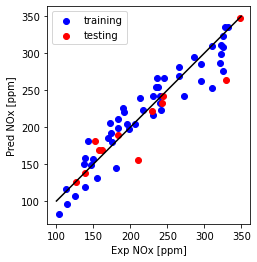

This blog post provides an introduction to machine learning, covering topics such as linear regression, Ridge and Lasso regression, logistic regression for classification, and the k-means algorithm for unsupervised learning. The post is compatible with Google Colaboratory and can be accessed through this link:

<a href="https://colab.research.google.com/github/arminnorouzi/machine_learning_course_UofA_MECE610/blob/main/L01_Introduction_to_Machine_Learning/L01a_Introduction_to-Machine_Learning.ipynb" target="_parent"></a>

# Introduction to Machine Learning

- Developed by **Armin Norouzi**
- Compatible with Google Colaboratory

**Table of Contents:**

1.  Machine Learning Background
2.  Linear regression
3.  Ridge and Lasso regression
4.  Logistic regression - classification
5.  Unsupervised Learning - k-means algorithm

## Machine Learning Background

### Machine Learning definition

Machine learning (ML) is the study of computer algorithms that can improve themselves automatically as a result of experience and data consumption. It is considered to be a component of artificial intelligence. Machine learning algorithms construct a model from sample data, referred to as training data, in order to generate predictions or judgments without explicitly programming them to do so. Machine learning algorithms are utilised in a broad variety of applications, including medicine, email filtering, speech recognition, and computer vision, where developing traditional algorithms to do the required tasks is difficult or impossible.

In general, ML can be divided into three main categories:

1. **Supervised learning:** Supervised learning algorithms build a mathematical model of a set of data that contains both the inputs and the desired outputs.
2. **Unsupervised learning:** Unsupervised learning algorithms take a set of data that contains only inputs, and find structure in the data, like grouping or clustering of data points. The algorithms, therefore, learn from test data that has not been labeled, classified or categorized.
3. **Reinforcement Learning (RL):** Reinforcement learning is an area of machine learning concerned with how software agents ought to take actions in an environment so as to maximize some notion of cumulative reward.

### Feature Engineering

Feature engineering is a type of machine learning technique that makes use of data to generate new variables that are not included in the training set. It is capable of generating novel features for both supervised and unsupervised learning, with the goal of simplifying and speeding up data transformations while also improving model accuracy. When working with machine learning models, feature engineering is essential. Whatever the data or architecture, a suboptimal feature will have a direct effect on your model.

1. **Imputation**

When it comes to prepping data for machine learning, one of the most common concerns is missing values. Missing values can be caused by a variety of circumstances, including human mistake, data flow interruptions, privacy problems, and others. For whatever reason, missing values degrade the performance of machine learning models. Imputation's primary objective is to deal with missing values.

2. **Handling Outliers**

Outlier handling is a statistical strategy for identifying and eliminating outliers from a dataset. This strategy can be applied at many scales to generate a more accurate depiction of data. This has an effect on the performance of the model. The effect can be large or little, depending on the model; for example, linear regression is extremely susceptible to outliers. This method should be carried out prior to the start of model training. Among the several strategies for dealing with outliers are the following:

**Removal:** Outlier-containing entries are deleted from the distribution. However, if there are outliers across numerous variables, this strategy may result in a big chunk of the datasheet being missed.

**Replacing values:** Alternatively, the outliers could be handled as missing values and replaced with suitable imputation.

**Capping:** Using an arbitrary value or a value from a variable distribution to replace the maximum and minimum values.

3. **Log Transform**

Log Transform is the most used technique among data scientists. It is mostly used to turn a skewed distribution into a normal or less-skewed distribution.

$ (x,y) ⇒ (\log(x),\log(y)) $

4. **One-hot encoding**

A one-hot encoding is a sort of encoding in which each element of a finite set is represented by its index, with just one element having its index set to "1" and the remaining elements having indices between [0, n-1]. In contrast to binary encoding systems, which allow for the representation of two values (i.e. 0 and 1) per bit, this technique assigns a unique value to each feasible situation.

5. **Scaling**

Scaling features is a common and challenging topic in machine learning, but it is critical to get right. To train a predictive model, we want data with a well-defined collection of features that can be scaled up or down as necessary.

**Normalization:** All values are scaled in a specified range between 0 and 1 via normalisation (or min-max normalisation). This modification has no influence on the feature’s distribution, however it does exacerbate the effects of outliers due to lower standard deviations. As a result, it is advised that outliers be dealt with prior to normalisation.

$ x*n = \frac{x- x*{min}}{x*{max}-x*{min}} $

**Standardization:** Standardization (also known as z-score normalisation) is the process of scaling values while accounting for standard deviation $\sigma$ . If the standard deviation of features differs, the range of those features will likewise differ. The effect of outliers in the characteristics is reduced as a result. To arrive at a distribution with a 0 mean $\mu$ and 1 variance, all the data points are subtracted by their mean and the result divided by the distribution’s variance.

$ x_s = \frac{x- \mu}{\sigma} $

### Tunning model:Bias and Variance trade-off

It is critical to understand prediction errors whenever we discuss model prediction (bias and variance). Between the ability of a model to minimise bias and variance, there is a trade-off. Accurately understanding these flaws will aid us in not just developing accurate models but also in avoiding the errors of overfitting and underfitting.

1. **Bias:** Bias is the variance between our model's average forecast and the actual value we are attempting to predict. A model with a large bias ignores the training data and oversimplifies the model. It always results in a high level of inaccuracy on both training and test data.

2. **Variance:** The variance of a model prediction for a given data point or value indicates the spread of our data. A model with a large variance pays close attention to training data and does not generalise to new input. As a result, while these models perform admirably on training data, they exhibit substantial error rates on test data.

Underfitting occurs in supervised learning when a model is unable to grasp the underlying pattern of the data. These models typically exhibit a high degree of bias and a low degree of variance. This occurs when there is insufficient data to develop an appropriate model or when we attempt to build a linear model using nonlinear data. Additionally, certain types of models, such as linear and logistic regression, are extremely simple to use for capturing complicated patterns in data.

Overfitting occurs in supervised learning when our model catches both the noise and the underlying pattern in the data. This occurs when we train our model extensively over a noisy dataset. These models have a little bias but a large variance. These are extremely sophisticated models, similar to decision trees, and are prone to overfitting.


**Why is Bias Variance Tradeoff?**

If our model is oversimplified and contains a small number of parameters, it may have a high bias and a low variance. On the other hand, if our model contains a big number of parameters, it will exhibit a high degree of variance and a low degree of bias. Thus, we must strike a balance between overfitting and underfitting the data. This complexity trade-off is the reason for the trade-off between bias and variation. An algorithm cannot be both more and less complex. A model with an ideal balance of bias and variance will never be over- or under-fit.


## Linear regression

### Least Squares Linear Regression

- should be a review
- highlight concepts in:
  - **frequentist statistics::** in which model parameters are assumed fixed and we do not specify prior beliefs over these parameters
  - **Bayesian statistics::** which focuses on computing the posterior belief over model parameters given a prior

### Linear regression

- regression with linear functions as:

\begin{equation}
\hat{y} = f( \mathbf{x}) = \mathbf{\theta}^T \mathbf{x}.
\end{equation}

- where $ \mathbf{\theta}$ are the parameters of the model.
- Note that the linear function above has an intercept at zero - there is no offset term.
- assume throughout for linear regression that the input vector is augmented with a $1$, so that

\begin{equation}
\hat{y} = \theta_0 + \mathbf{\theta}^T \mathbf{x} =
\begin{bmatrix}
\theta_0 & \mathbf{\theta}^T
\end{bmatrix}
\begin{bmatrix}
1\\
\mathbf{x}
\end{bmatrix}.
\end{equation}

Thus when we write $ \mathbf{x}$, simply imagine the input augmented with a 1 at the first entry.

**Using Mean Squared Error (MSE) loss**

- the Mean Squared Error} (MSE) cost function is:

\begin{equation}
J(\theta) = \frac{1}{d}\sum\_{i=1}^{d} \left( y_i - \hat{y} \right)^2.
\end{equation}

- this is the most common loss function in regression problems due to several favorable properties
- minimizing this loss encodes the objective of minimizing the squared error in our prediction.
- Given our linear model parameterization and this loss function, we can now fully specify our regression problem as:

\begin{equation}
\begin{split}
& \underset{ \mathbf{\theta}}{\min}
& & \frac{1}{d}\sum\_{i=1}^{d} \left( y_i - \mathbf{\theta}^T \mathbf{x}\_i \right)^2
\end{split}
\end{equation}

- rewrite as

\begin{equation}
\begin{split}
& \underset{ \mathbf{\theta}}{\min}
& & \left\| \mathbf{y} - X \mathbf{\theta} \right\|\_2^2
\end{split}
\end{equation}

- have multiplied the objective by $d$ to simplify notation
- where $ \mathbf{y}^T = [y_1, \ldots, y_d]$ and$X^T = [ \mathbf{x}_1, \ldots,  \mathbf{x}_d]$
  - The matrix $ X^T $ is typically referred to as the \textit{design matrix}.

**Solve by setting the gradient to zero:**

- Eq \ref{eq:least_squares} that this loss is convex in the model parameters and is differentiable with continuous derivative (in class $C^1$).
- know any point satisfying the first order necessary conditions for optimality is a global minimizer.
- to solve this problem compute the gradient as:

\begin{align}
\nabla\_{ \mathbf{\theta}}\left\| \mathbf{y} - X \mathbf{\theta} \right\|\_2^2 = 2X^T X \mathbf{\theta} - 2 X^T \mathbf{y}
\label{eq:LS_grad}
\end{align}

- then set the gradient to zero, resulting in:

\begin{equation}
X^T X \mathbf{\theta} = X^T \mathbf{y}.
\label{eq:LS_grad2}
\end{equation}

- If $X^T X$ is invertible then the optimal set of parameters is

\begin{equation}
\hat{ \mathbf{\theta}} = (X^T X)^{-1} X^T \mathbf{y}.
\label{eq:norm_eq}
\end{equation}

We will write the set of parameters that solve the least squares problem in the overdetermined form (as above) as $\hat{ \mathbf{\theta}}_{LS}$.

**When is \(X^T X\) invertible?**

\begin{equation}
X^T X = \sum\_{i=1}^{d} \mathbf{x}\_i \mathbf{x}\_i^T.
\end{equation}

- Let $n$ denote the dimension of the input.
- Then, we require $d > n$ for $X^T X$ to be full rank.
- However, at least $n$ input is not a sufficient condition for $X^T X$ to be full rank;
  - we also require at least $n$ linearly independent inputs.

### Example Normal Equations: Diesel Engine

In this example, the Engine NOx model is modeled using different features

```python
# Python setup and load libraries

import pandas as pd
import numpy as np
import math
import operator
import matplotlib.pyplot as plt
get_ipython().run_line_magic('matplotlib', 'inline')
```

**Setup an array to store**

- the parameter vector $\theta$
- the columns are $\theta = [ \theta_0 \theta_1 \theta_2 \theta_3 \theta_4]^T $

```python
# max number of parameters
ntheta = 5
# maximum number of cases
ncases = 10
# counter for case number
nc = 0
# create the array of theta's
thetav = np.zeros((ncases, ntheta))
```

**Setup an array to store errors**

- the error vector is; MAE, MSE, R2, lambda
- set $\lambda = 0$ for normal regression and use for Ridge or Lasso

```python
nerr = 4
errv = np.zeros((ncases, nerr))
```

**Import Engine Data**

Stationary Diesel engine data with

| Load [ft.lb]|Engine speed [rpm]|mf [mg/stroke]|Pr [PSI]|NOx [ppm]|

```python
data = pd.read_csv('https://raw.githubusercontent.com/arminnorouzi/ML-developed_course/main/Data/Engine_NOx.csv') #Set with your directory
data.head()
```

  <div id="df-351b052c-58d3-4c71-b572-1418a806cafb">
    <div class="colab-df-container">
      <div>
<style scoped>
    .dataframe tbody tr th:only-of-type {
        vertical-align: middle;
    }

    .dataframe tbody tr th {
        vertical-align: top;
    }

    .dataframe thead th {
        text-align: right;
    }

</style>
<table border="1" class="dataframe">
  <thead>
    <tr style="text-align: right;">
      <th></th>
      <th>Load [ft.lb]</th>
      <th>Engine speed [rpm]</th>
      <th>mf [mg/stroke]</th>
      <th>Pr [PSI]</th>
      <th>NOx [ppm]</th>
    </tr>
  </thead>
  <tbody>
    <tr>
      <th>0</th>
      <td>50</td>
      <td>1549.501134</td>
      <td>24.608617</td>
      <td>14303.37188</td>
      <td>172.751046</td>
    </tr>
    <tr>
      <th>1</th>
      <td>75</td>
      <td>1492.000000</td>
      <td>28.400000</td>
      <td>13795.00000</td>
      <td>217.639851</td>
    </tr>
    <tr>
      <th>2</th>
      <td>100</td>
      <td>1505.701878</td>
      <td>33.679754</td>
      <td>13547.30399</td>
      <td>239.576076</td>
    </tr>
    <tr>
      <th>3</th>
      <td>125</td>
      <td>1505.000000</td>
      <td>40.000000</td>
      <td>12982.00000</td>
      <td>272.449899</td>
    </tr>
    <tr>
      <th>4</th>
      <td>150</td>
      <td>1506.710526</td>
      <td>45.168421</td>
      <td>12679.94737</td>
      <td>310.225311</td>
    </tr>
  </tbody>
</table>
</div>
      <button class="colab-df-convert" onclick="convertToInteractive('df-351b052c-58d3-4c71-b572-1418a806cafb')"
              title="Convert this dataframe to an interactive table."
              style="display:none;">

<svg xmlns="http://www.w3.org/2000/svg" height="24px"viewBox="0 0 24 24"
width="24px">
<path d="M0 0h24v24H0V0z" fill="none"/>
<path d="M18.56 5.44l.94 2.06.94-2.06 2.06-.94-2.06-.94-.94-2.06-.94 2.06-2.06.94zm-11 1L8.5 8.5l.94-2.06 2.06-.94-2.06-.94L8.5 2.5l-.94 2.06-2.06.94zm10 10l.94 2.06.94-2.06 2.06-.94-2.06-.94-.94-2.06-.94 2.06-2.06.94z"/><path d="M17.41 7.96l-1.37-1.37c-.4-.4-.92-.59-1.43-.59-.52 0-1.04.2-1.43.59L10.3 9.45l-7.72 7.72c-.78.78-.78 2.05 0 2.83L4 21.41c.39.39.9.59 1.41.59.51 0 1.02-.2 1.41-.59l7.78-7.78 2.81-2.81c.8-.78.8-2.07 0-2.86zM5.41 20L4 18.59l7.72-7.72 1.47 1.35L5.41 20z"/>
</svg>
</button>

  <style>
    .colab-df-container {
      display:flex;
      flex-wrap:wrap;
      gap: 12px;
    }

    .colab-df-convert {
      background-color: #E8F0FE;
      border: none;
      border-radius: 50%;
      cursor: pointer;
      display: none;
      fill: #1967D2;
      height: 32px;
      padding: 0 0 0 0;
      width: 32px;
    }

    .colab-df-convert:hover {
      background-color: #E2EBFA;
      box-shadow: 0px 1px 2px rgba(60, 64, 67, 0.3), 0px 1px 3px 1px rgba(60, 64, 67, 0.15);
      fill: #174EA6;
    }

    [theme=dark] .colab-df-convert {
      background-color: #3B4455;
      fill: #D2E3FC;
    }

    [theme=dark] .colab-df-convert:hover {
      background-color: #434B5C;
      box-shadow: 0px 1px 3px 1px rgba(0, 0, 0, 0.15);
      filter: drop-shadow(0px 1px 2px rgba(0, 0, 0, 0.3));
      fill: #FFFFFF;
    }
  </style>

      <script>
        const buttonEl =
          document.querySelector('#df-351b052c-58d3-4c71-b572-1418a806cafb button.colab-df-convert');
        buttonEl.style.display =
          google.colab.kernel.accessAllowed ? 'block' : 'none';

        async function convertToInteractive(key) {
          const element = document.querySelector('#df-351b052c-58d3-4c71-b572-1418a806cafb');
          const dataTable =
            await google.colab.kernel.invokeFunction('convertToInteractive',
                                                     [key], {});
          if (!dataTable) return;

          const docLinkHtml = 'Like what you see? Visit the ' +
            '<a target="_blank" href=https://colab.research.google.com/notebooks/data_table.ipynb>data table notebook</a>'
            + ' to learn more about interactive tables.';
          element.innerHTML = '';
          dataTable['output_type'] = 'display_data';
          await google.colab.output.renderOutput(dataTable, element);
          const docLink = document.createElement('div');
          docLink.innerHTML = docLinkHtml;
          element.appendChild(docLink);
        }
      </script>
    </div>

  </div>

**Plot NOx as a function of load to look at the data**

- the one \`feature' here is Load (and a constant)
- so later will fit NOx = $\text{load}\theta_1 + \theta_0 $

```python
plt.scatter(data['Load [ft.lb]'], data['NOx [ppm]'],  color='blue')
plt.xlabel("Load [ft.lb]")
plt.ylabel("NOx [ppm]")
plt.show()
```


**Split the data in training and test data**

- usually you want to validate your fit on data that was not used to fit the data
- here randomly select 80% of the data for fitting (training) - the 80% is arbitrarily selected
- the remaining 20% will be used to validate (test data)

```python
cdf = data[['Load [ft.lb]','Engine speed [rpm]','mf [mg/stroke]','Pr [PSI]', 'NOx [ppm]']]

msk = np.random.rand(len(data)) < 0.8
train = cdf[msk]
test = cdf[~msk]
```

**Plot the test and training data**

```python
plt.scatter(train['Load [ft.lb]'], train['NOx [ppm]'],  color='blue')
plt.scatter(test['Load [ft.lb]'], test['NOx [ppm]'],  color='red')
plt.xlabel("Load [ft.lb]")
plt.ylabel("NOx [ppm]")
plt.show()
```


**Prepare the data for sklearn**

- sklearn is a python library for Machine Learning
- divide into test and train and set min and max: $\frac{x-\min(x)}{\max(x) - \min(x)}$

```python
from sklearn import preprocessing

train_x = np.asanyarray(train[['Load [ft.lb]']])
train_y = np.asanyarray(train[['NOx [ppm]']])

test_x = np.asanyarray(test[['Load [ft.lb]']])
test_y = np.asanyarray(test[['NOx [ppm]']])


min_max_scaler = preprocessing.MinMaxScaler()
X_train_minmax = min_max_scaler.fit_transform(train_x)
X_test_minmax = min_max_scaler.transform(test_x)
```

**Preparing data for normal equation**

- set up $X$ to be a constant (ones) and Load, while $y$ is NOx

```python
numsamples = X_train_minmax.shape[0]
# 1st row is ones and second row is x
Xtrain = np.c_[np.ones((numsamples,1)),X_train_minmax]
ytrain = train_y
```

#### Linear regression using normal equation

- solve and print coefficients

```python
theta_lin = np.dot(np.dot(np.linalg.inv(np.dot(Xtrain.T, Xtrain) / numsamples), Xtrain.T), ytrain) / numsamples
print ('Normal Equations: Coefficients: ', theta_lin[1])
print ('Normal Equations: Intercept: ',theta_lin[0])
# store this case
nc = 0
thetav[nc][0] = theta_lin[0]
thetav[nc][1] = theta_lin[1]
```

    Normal Equations: Coefficients:  [190.52511735]
    Normal Equations: Intercept:  [141.62731584]

- then plot the fit to the training data. Fit is: NOx = $\text{load}\theta_1 + \theta_0 $
- this method is really never numerically used in practice

```python
plt.scatter(train['Load [ft.lb]'], train['NOx [ppm]'],  color='blue')
plt.plot(train_x, theta_lin[1]*X_train_minmax + theta_lin[0], '-r')
plt.xlabel("Load [ft.lb]")
plt.ylabel("NOx [ppm]")
plt.show()
```


**Now plot Predicted NOx versus Measured**

- the closer to the diagonal line the better the fit

```python
plt.plot([100,350], [100, 350],  '-k')
plt.scatter(train['NOx [ppm]'], theta_lin[1]*X_train_minmax + theta_lin[0],  color='blue', label='training')
plt.scatter(test['NOx [ppm]'], theta_lin[1]*X_test_minmax + theta_lin[0],  color='red', label='testing')
plt.xlabel("Exp NOx [ppm]")
plt.ylabel("Pred NOx [ppm]")
plt.legend()
plt.gca().set_aspect('equal', adjustable='box')
plt.show()
```


#### Use sklean package for linear regression

Define the model type to be a linear regression

```python
from sklearn import linear_model
# model type
regr = linear_model.LinearRegression()
regr.fit (X_train_minmax, train_y)
# The coefficients
print ('Coefficients: ', regr.coef_)
print ('Intercept: ',regr.intercept_)
nc = 1
thetav[nc][0] = regr.intercept_
thetav[nc][1] = regr.coef_
```

    Coefficients:  [[190.52511735]]
    Intercept:  [141.62731584]

- the result is the same - you can plot it yourself to check

#### Using multiple feature using hand-written gradient descent:

We had only one feature in the previous part; now we can find a better fit using multiple features.

**Training/test split and plot**

**Training and test data is split**

```python
cdf = data[['Load [ft.lb]','Engine speed [rpm]','mf [mg/stroke]','Pr [PSI]', 'NOx [ppm]']]
msk = np.random.rand(len(data)) < 0.8
train = cdf[msk]
test = cdf[~msk]
```

**Plot NOx versus Load**

```python
plt.scatter(train['Load [ft.lb]'], train['NOx [ppm]'],  color='blue', label='training')
plt.scatter(test['Load [ft.lb]'], test['NOx [ppm]'],  color='red', label='test')
plt.xlabel("Load [ft.lb]")
plt.ylabel("NOx [ppm]")
plt.legend()
plt.show()
```


**Now fit with Multi-features**

Now repeat single feature regression but with multi-features
$ NOx = \theta_0 + \text{load}\theta_1 + \text{speed}\theta_2 + m_f\theta_3 + P_r\theta_4$

```python
from sklearn import preprocessing

train_x = np.asanyarray(train[['Load [ft.lb]','Engine speed [rpm]','mf [mg/stroke]','Pr [PSI]']])
train_y = np.asanyarray(train[['NOx [ppm]']])

test_x = np.asanyarray(test[['Load [ft.lb]','Engine speed [rpm]','mf [mg/stroke]','Pr [PSI]']])
test_y = np.asanyarray(test[['NOx [ppm]']])

# train_x = np.asanyarray(train[['Load [ft.lb]']])
# train_y = np.asanyarray(train[['NOx [ppm]']])

# test_x = np.asanyarray(test[['Load [ft.lb]']])
# test_y = np.asanyarray(test[['NOx [ppm]']])


min_max_scaler = preprocessing.MinMaxScaler()
X_train_minmax = min_max_scaler.fit_transform(train_x)
X_test_minmax = min_max_scaler.transform(test_x)
```

**Find theta**

```python
numsamples = X_train_minmax.shape[0]

X_b = np.c_[np.ones((numsamples,1)),X_train_minmax]
X_t = np.c_[np.ones((X_test_minmax.shape[0],1)),X_test_minmax]
theta = np.linalg.inv(X_b.T.dot(X_b)).dot(X_b.T).dot(train_y)
# Store theta - normal equations
nc = 2
thetav[nc:nc+1] = theta.T
print(theta)
```

    [[ 198.34138271]
     [ 243.74667837]
     [-112.39291324]
     [-110.72189741]
     [   7.43165093]]

**Plot predicted versus experimental**

```python
plt.plot([100,350], [100, 350],  '-k')
plt.scatter(train_y, np.dot(theta.T,X_b.T),  color='blue', label='training')
plt.scatter(test_y, np.dot(theta.T,X_t.T),  color='red', label='testing')
plt.xlabel("Exp NOx [ppm]")
plt.ylabel("Pred NOx [ppm]")
plt.legend()
plt.gca().set_aspect('equal', adjustable='box')
plt.show()
```


**Evaluation of model: Print fit errors (MAE, MSE, R2)**

Import $R^2$ from sklearn

```python
from sklearn.metrics import r2_score
mae = np.mean(np.absolute(np.dot(theta.T,X_t.T).T - test_y))
mse = np.mean((np.dot(theta.T,X_t.T).T - test_y) ** 2)
r2 = r2_score(np.dot(theta.T,X_t.T).T , test_y)
print("Multi Feature: Mean absolute error: %.2f" % mae)
print("Multi Feature: Residual sum of squares (MSE): %.2f" % mse)
print("Multi Feature: R2-score: %.2f" % r2 )
# the last column is lambda
errv[nc:nc+1] = [mae, mse, r2, 0]
```

    Multi Feature: Mean absolute error: 16.04
    Multi Feature: Residual sum of squares (MSE): 633.87
    Multi Feature: R2-score: 0.82

**Cost Function and Gradients**

- The equation for calculating cost function and gradients are as shown below.
- Please note the cost function is for Linear regression.
- For other algorithms the cost function will be different and the gradients would have to be derived from the cost functions

**Cost**

\begin{equation}
J(\theta) = 1/2m \sum\_{i=1}^{m} (h(\theta)^{(i)} - y^{(i)})^2
\end{equation}

**Gradient**

\begin{equation}
\frac{\partial J(\theta)}{\partial \theta*j} = 1/m\sum*{i=1}^{m}(h(\theta)^{(i)} - y^{(i)}).X_j^{(i)}
\end{equation}

Where $ h(\theta) \longrightarrow \hat{y}$ the predicted output

**Gradients**

\begin{equation}
\theta*0: = \theta_0 -\alpha . (1/m .\sum*{i=1}^{m}(h(\theta)^{(i)} - y^{(i)}).X_0^{(i)})
\end{equation}

\begin{equation}
\theta*1: = \theta_1 -\alpha . (1/m .\sum*{i=1}^{m}(h(\theta)^{(i)} - y^{(i)}).X_1^{(i)})
\end{equation}

\begin{equation}
\theta*2: = \theta_2 -\alpha . (1/m .\sum*{i=1}^{m}(h(\theta)^{(i)} - y^{(i)}).X_2^{(i)})
\end{equation}

\begin{equation}
\theta*j: = \theta_j -\alpha . (1/m .\sum*{i=1}^{m}(h(\theta)^{(i)} - y^{(i)}).X_0^{(i)})
\end{equation}

**Cost Calculation function**

```python
def  cal_cost(theta,X,y):
    '''

    Calculates the cost for given X and Y. The following shows and example of a single dimensional X
    theta = Vector of thetas
    X     = Row of X's np.zeros((2,j))
    y     = Actual y's np.zeros((2,1))

    where:
        j is the no of features
    '''

    m = len(y)
    # yhat = theta^T x
    predictions = X.dot(theta)
    # sum the squares of yhat - y
    cost = 1/(2*m) * np.sum(np.square(predictions-y))
    return cost
```

**Gradient Descent function**

```python
def gradient_descent(X,y,theta,learning_rate=0.01,iterations=100):
    '''
    X    = Matrix of X with added bias units
    y    = Vector of Y
    theta=Vector of thetas np.random.randn(j,1)
    learning_rate
    iterations = no of iterations

    Returns the final theta vector and array of cost history over no of iterations
    '''
    m = len(y)
    cost_history = np.zeros(iterations)
    theta_history = np.zeros((iterations,5))
    for it in range(iterations):

        prediction = np.dot(X, theta)

        theta = theta -(1/m)*learning_rate*( X.T.dot((prediction - y)))
        theta_history[it,:] =theta.T
        cost_history[it]  = cal_cost(theta,X,y)

    return theta, cost_history, theta_history
```

**Gradient Descent for NOx modeling**

```python
lr =0.1
n_iter = 1000

theta = np.random.randn(5,1)


X_b = np.c_[np.ones((len(X_train_minmax),1)),X_train_minmax]

theta,cost_history,theta_history = gradient_descent(X_b,train_y,theta,lr,n_iter)
```

- print result

```python
print('Theta0: {:0.3f},\nTheta1: {:0.3f},\nTheta2: {:0.3f},\nTheta3: {:0.3f},\nTheta4: {:0.3f}'.format(theta[0][0],theta[1][0],theta[2][0],theta[3][0],theta[4][0]))
print('Final cost:  {:0.3f}'.format(cost_history[-1]))
# Store theta - gradient
nc = 3
thetav[nc:nc+1] = theta.T
print(theta)
```

    Theta0: 198.504,
    Theta1: 90.837,
    Theta2: -140.021,
    Theta3: 47.973,
    Theta4: 19.645
    Final cost:  243.685
    [[ 198.50447465]
     [  90.83725051]
     [-140.02145278]
     [  47.97342353]
     [  19.64471337]]

**Plot - the cost J as a function of iterations**

- set figure axis and labels

```python
fig,ax = plt.subplots(figsize=(6,4))

ax.set_ylabel('J(Theta)')
ax.set_xlabel('Iterations')
_=ax.plot(range(n_iter),cost_history,'b.')
ax.set_yscale('log')
```


**Plot Predicted NOx versus Experimental**

```python
plt.plot([100,350], [100, 350],  '-k')
plt.scatter(train_y, np.dot(theta.T,X_b.T),  color='blue', label='training')
plt.scatter(test_y, np.dot(theta.T,X_t.T),  color='red', label='testing')
plt.xlabel("Exp NOx [ppm]")
plt.ylabel("Pred NOx [ppm]")
plt.legend()
plt.gca().set_aspect('equal', adjustable='box')
plt.show()
```



**Print MAE, MSE and R2**

```python
from sklearn.metrics import r2_score
mae = np.mean(np.absolute(np.dot(theta.T,X_t.T).T - test_y))
mse = np.mean((np.dot(theta.T,X_t.T).T - test_y) ** 2)
r2 = r2_score(np.dot(theta.T,X_t.T).T , test_y)
print("Multi Feature: Mean absolute error: %.2f" % mae)
print("Multi Feature: Residual sum of squares (MSE): %.2f" % mse)
print("Multi Feature: R2-score: %.2f" % r2 )
# the last column is lambda
errv[nc:nc+1] = [mae, mse, r2, 0]
```

    Multi Feature: Mean absolute error: 16.33
    Multi Feature: Residual sum of squares (MSE): 705.80
    Multi Feature: R2-score: 0.80

## Regularized Objective-- Ridge regression

### Least Squares (LS) underdetermined - add regularized objective term

- for the exact computation of $\hat{ \mathbf{\theta}}_{LS}$ considering the problem geometrically provides intuition
- The invertability of $X^T X$ implies the unique existence of a set of parameters $ \mathbf{\theta}$ that minimizes \eqref{eq:least_squares}
- In the case that we have fewer linearly independent data points than $n$, \eqref{eq:LS_grad2} is not unique.
  - Then there exist multiple values of $ \mathbf{\theta}$ that result in zero error
  - and the system is underdetermined.
- A common approach to this is to optimize a regularized objective

\begin{equation}
\begin{aligned}
& \underset{ \mathbf{\theta}}{\min}
& & \left\| \mathbf{y} - X \mathbf{\theta} \right\|\_2^2 + \lambda \| \mathbf{\theta}\|^2_2
\end{aligned}
\label{eq:least_squares_norm}
\end{equation}

where $\lambda$ is a positive scalar.

**Ridge or Tikhanov regression**

- By adding in the regularization term $\| \mathbf{\theta}\|^2_2$
  - typically referred to as Ridge or Tikhanov regression, or $L_2$ regression due to the use of the 2-norm)
  - the optimal value of $ \mathbf{\theta}$ is biased toward having a small norm.
  - Following a similar approach for normal equation, gives

\begin{equation}
\hat{ \mathbf{\theta}} = (X^T X + \lambda I)^{-1} X^T \mathbf{y}
\end{equation}

- for which the $X^T X + \lambda I$ is always full rank and thus invertible.
- the solution to the ridge regularized problem is denoted $\hat{ \mathbf{\theta}}_{RR}$

- for positive $\lambda$, $\|  \mathbf{y} - X  \mathbf{\theta}\|_2^2$ may not be zero
  - the estimator of the parameters is biased.
  - As $\lambda$ gets smaller, this bias will decrease.
- In the limit of $\lambda \to 0$, we have

\begin{equation}
(X^T X + \lambda I)^{-1} X^T \to X^T (X X^T)^{-1}
\end{equation}

- the least norm solution

\begin{equation}
\hat{ \mathbf{\theta}}\_{LN} = X^T (X X^T)^{-1} \mathbf{y}.
\end{equation}

- the least norm solution is the set of parameters that achieves zero loss while simultaneously minimizing the 2-norm of the parameter vector.

**Least norm vs ridge regression**

- why use the ridge regression with a positive value of $\lambda$
- The added bias from the regularization helps generalize to new data points without <span class="underline">overfitting</span> to the training dataset.
- Regularization is an important concept in machine learning discussed later
- further, ridge regression problem arises naturally in Bayesian inference

### Ridge regression example in Python

#### Ridge regression single feature using normal equation

Now repeat single feature regression but with ridge regularization

```python
from sklearn import preprocessing

train_x = np.asanyarray(train[['Load [ft.lb]']])
train_y = np.asanyarray(train[['NOx [ppm]']])

test_x = np.asanyarray(test[['Load [ft.lb]']])
test_y = np.asanyarray(test[['NOx [ppm]']])


min_max_scaler = preprocessing.MinMaxScaler()
X_train_minmax = min_max_scaler.fit_transform(train_x)
X_test_minmax = min_max_scaler.transform(test_x)
```

```python
numsamples = X_train_minmax.shape[0]
# 1st row is ones and second row is x
Xtrain = np.c_[np.ones((numsamples,1)),X_train_minmax]
ytrain = train_y
```

Use regularization

```python
Lambda = 0.1

size = Xtrain.shape
theta_ridge = np.dot(np.dot(np.linalg.inv(
            np.add(np.dot(Xtrain.T, Xtrain) / 1, np.multiply(Lambda, np.identity(size[1])))),
                                     Xtrain.T), ytrain) / 1

# The coefficients
print ('Coefficients: ', theta_ridge[1])
print ('Intercept: ',theta_ridge[0])
```

    Coefficients:  [163.89339829]
    Intercept:  [146.7754385]

**Plot fit on training data**

```python
plt.scatter(train['Load [ft.lb]'], train['NOx [ppm]'],  color='blue')
plt.plot(train_x, theta_ridge[0]+X_train_minmax * theta_ridge[1], '-r')
plt.xlabel("Load [ft.lb]")
plt.ylabel("NOx [ppm]")
plt.show()
```


**Plot NOx prediction versus Experimental**

```python
plt.plot([100,350], [100, 350],  '-k')
plt.scatter(train['NOx [ppm]'], theta_ridge[0]*X_train_minmax + theta_lin[1],  color='blue', label='training')
plt.scatter(test['NOx [ppm]'], theta_ridge[0]*X_test_minmax + theta_lin[1],  color='red', label='testing')
plt.xlabel("Exp NOx [ppm]")
plt.ylabel("Pred NOx [ppm]")
plt.legend()
plt.gca().set_aspect('equal', adjustable='box')
plt.show()
```


#### Ridge regression single feature using sklearn library

- in Python now use `sklearn` library
- Import ridge `Ridge` from `sklearn`

```python
from sklearn.linear_model import Ridge
#  definition of cost is differert in sklearn - gradient decsent is used here
Lambda = 0.1
# create regressor
regr_ridge = Ridge(alpha=Lambda)
# train regressor
regr_ridge.fit(X_train_minmax, train_y)

# The coefficients
print ('Coefficients: ', regr_ridge.coef_)
print ('Intercept: ',regr_ridge.intercept_)
```

    Coefficients:  [[162.48489639]]
    Intercept:  [147.72202208]

**Now plot linear with one feature**

```python
plt.scatter(train['Load [ft.lb]'], train['NOx [ppm]'],  color='blue')
plt.plot(train_x, regr_ridge.coef_[0][0]*X_train_minmax + regr_ridge.intercept_[0], '-r')
plt.xlabel("Load [ft.lb]")
plt.ylabel("NOx [ppm]")
plt.show()
```


```python
plt.plot([100,350], [100, 350],  '-k')
plt.scatter(train['NOx [ppm]'], regr_ridge.coef_[0][0]*X_train_minmax + regr_ridge.intercept_[0],  color='blue', label='training')
plt.scatter(test['NOx [ppm]'], regr_ridge.coef_[0][0]*X_test_minmax + regr_ridge.intercept_[0],  color='red', label='testing')
plt.xlabel("Exp NOx [ppm]")
plt.ylabel("Pred NOx [ppm]")
plt.legend()
plt.gca().set_aspect('equal', adjustable='box')
plt.show()
```


#### Ridge regression with multiple feature

- here try to improve the NOx model using:
  - more features as before use: load, speed, $m_f$, $P_r$ and a constant

```python
#  Preparing data for sklearn
from sklearn import preprocessing

train_x_miso = np.asanyarray(train[['Load [ft.lb]','Engine speed [rpm]','mf [mg/stroke]','Pr [PSI]']])
train_y_miso = np.asanyarray(train[['NOx [ppm]']])

test_x_miso = np.asanyarray(test[['Load [ft.lb]','Engine speed [rpm]','mf [mg/stroke]','Pr [PSI]']])
test_y_miso = np.asanyarray(test[['NOx [ppm]']])


min_max_scaler_miso = preprocessing.MinMaxScaler()
X_train_minmax_miso = min_max_scaler.fit_transform(train_x_miso)
X_test_minmax_miso = min_max_scaler.transform(test_x_miso)
```

**Fit the model and print coefficients**

```python
from sklearn import linear_model
regr_miso = linear_model.LinearRegression()
regr_miso.fit (X_train_minmax_miso, train_y)
# The coefficients
print ('Coefficients: ', regr_miso.coef_)
print ('Intercept: ',regr_miso.intercept_)
```

    Coefficients:  [[ 243.74667837 -112.39291324 -110.72189741    7.43165093]]
    Intercept:  [198.34138271]

```python
y_hat_regr_miso_tr = regr_miso.predict(X_train_minmax_miso) #training prediction
y_hat_regr_miso_ts = regr_miso.predict(X_test_minmax_miso) #testing prediction
```

**Plot NOx fit**

```python
plt.plot([100,350], [100, 350],  '-k')
plt.scatter(train['NOx [ppm]'], y_hat_regr_miso_tr,  color='blue', label='training')
plt.scatter(test['NOx [ppm]'], y_hat_regr_miso_ts,  color='red', label='testing')
plt.xlabel("Exp NOx [ppm]")
plt.ylabel("Pred NOx [ppm]")
plt.legend()
plt.gca().set_aspect('equal', adjustable='box')
plt.show()
```


#### Compare single and Multi feature model use - MSE, MAE, and $R^2$

```python
from sklearn.metrics import r2_score


print("Multi Feature: Mean absolute error: %.2f" % np.mean(np.absolute(y_hat_regr_miso_ts - test_y)))
print("Multi Feature: Residual sum of squares (MSE): %.2f" % np.mean((y_hat_regr_miso_ts - test_y) ** 2))
print("Multi Feature: R2-score: %.2f" % r2_score(y_hat_regr_miso_ts , test_y) )
```

    Multi Feature: Mean absolute error: 16.04
    Multi Feature: Residual sum of squares (MSE): 633.87
    Multi Feature: R2-score: 0.82

```python
y_hat_regr_tr = regr.predict(X_train_minmax) #training prediction
y_hat_regr_ts = regr.predict(X_test_minmax) #testing prediction

print("Single Feature: Mean absolute error: %.2f" % np.mean(np.absolute(y_hat_regr_ts - test_y)))
print("Single Feature: Residual sum of squares (MSE): %.2f" % np.mean((y_hat_regr_ts - test_y) ** 2))
print("Single Feature: R2-score: %.2f" % r2_score(y_hat_regr_ts , test_y) )
```

    Single Feature: Mean absolute error: 34.47
    Single Feature: Residual sum of squares (MSE): 1918.24
    Single Feature: R2-score: 0.27

#### Add regularization to multi-feature

```python
regr_ridge_miso = Ridge(alpha=0.1)
regr_ridge_miso.fit(X_train_minmax_miso, train_y)

# The coefficients
print ('Coefficients: ', regr_ridge_miso.coef_)
print ('Intercept: ',regr_ridge_miso.intercept_)
```

    Coefficients:  [[  94.33496675 -126.68345708   26.7261828    -3.40819817]]
    Intercept:  [215.16029914]

**multiple features prediction and plot**

```python
y_hat_regr_ridge_miso_tr = regr_ridge_miso.predict(X_train_minmax_miso) #training prediction
y_hat_regr_ridge_miso_ts = regr_ridge_miso.predict(X_test_minmax_miso) #testing prediction
```

```python
plt.plot([100,350], [100, 350],  '-k')
plt.scatter(train['NOx [ppm]'], y_hat_regr_ridge_miso_tr,  color='blue', label='training')
plt.scatter(test['NOx [ppm]'], y_hat_regr_ridge_miso_ts,  color='red', label='testing')
plt.xlabel("Exp NOx [ppm]")
plt.ylabel("Pred NOx [ppm]")
plt.legend()
plt.gca().set_aspect('equal', adjustable='box')
plt.show()

print("Multi Feature (Ridge): Mean absolute error: %.2f" % np.mean(np.absolute(y_hat_regr_ridge_miso_ts - test_y)))
print("Multi Feature (Ridge): Residual sum of squares (MSE): %.2f" % np.mean((y_hat_regr_ridge_miso_ts - test_y) ** 2))
print("Multi Feature (Ridge): R2-score: %.2f" % r2_score(y_hat_regr_ridge_miso_ts , test_y) )
```


    Multi Feature (Ridge): Mean absolute error: 16.99
    Multi Feature (Ridge): Residual sum of squares (MSE): 716.01
    Multi Feature (Ridge): R2-score: 0.79

- Mean absolute error and Residual sum of squares (MSE) increased slightly over the test data while R2 is the same

#### Use polynomial features

- first import function to create polynomial features
- get 15 terms with all cross products

```python
from sklearn.preprocessing import PolynomialFeatures

train_x_p = np.asanyarray(train[['Load [ft.lb]','Engine speed [rpm]','mf [mg/stroke]','Pr [PSI]']])
train_y_p = np.asanyarray(train[['NOx [ppm]']])

test_x_p = np.asanyarray(test[['Load [ft.lb]','Engine speed [rpm]','mf [mg/stroke]','Pr [PSI]']])
test_y_p = np.asanyarray(test[['NOx [ppm]']])
# here use polynomials of degree 2
poly = PolynomialFeatures(degree=2)
train_x_poly = poly.fit_transform(train_x_p)
test_x_poly = poly.fit_transform(test_x_p)

min_max_scaler_ploy = preprocessing.MinMaxScaler()
X_train_minmax_ploy = min_max_scaler.fit_transform(train_x_poly)
X_test_minmax_ploy = min_max_scaler.transform(test_x_poly)
```

```python
regr_poly = linear_model.LinearRegression()

regr_poly.fit (X_train_minmax_ploy, train_y_p)
# The coefficients
print ('Coefficients: ', regr_poly.coef_)
print ('Intercept: ',regr_poly.intercept_)
```

    Coefficients:  [[    0.          4348.66577304  -121.8563461  -3664.91692746
        582.22516193  -880.562787    -628.90576941  -683.02423169
      -2476.77756311   305.39856591  -221.52557924  -251.96032306
       1616.10927063  2790.01960598  -574.35698449]]
    Intercept:  [208.59598226]

**training and test prediction and plot for polynomial features**

- now, perform multi-feature regression with polynomial basis

```python
y_hat_regr_poly_tr = regr_poly.predict(X_train_minmax_ploy) #training prediction
y_hat_regr_poly_ts = regr_poly.predict(X_test_minmax_ploy) #testing prediction
```

```python
plt.plot([100,350], [100, 350],  '-k')
plt.scatter(train['NOx [ppm]'], y_hat_regr_poly_tr,  color='blue', label='training')
plt.scatter(test['NOx [ppm]'], y_hat_regr_poly_ts,  color='red', label='testing')
plt.xlabel("Exp NOx [ppm]")
plt.ylabel("Pred NOx [ppm]")
plt.legend()
plt.gca().set_aspect('equal', adjustable='box')
plt.show()
```


```python
print("Multi Feature + polynomial- testing Mean absolute error: %.2f" % np.mean(np.absolute(y_hat_regr_poly_ts - test_y)))
print("Multi Feature + polynomial- testing sum of squares (MSE): %.2f" % np.mean((y_hat_regr_poly_ts - test_y) ** 2))
print("Multi Feature + polynomial- testing R2-score: %.2f" % r2_score(y_hat_regr_poly_ts , test_y) )
```

    Multi Feature + polynomial- testing Mean absolute error: 13.36
    Multi Feature + polynomial- testing sum of squares (MSE): 476.55
    Multi Feature + polynomial- testing R2-score: 0.90

```python
# training:
print("Multi Feature + polynomial- training Mean absolute error: %.2f" % np.mean(np.absolute(y_hat_regr_poly_tr - train_y)))
print("Multi Feature + polynomial- training sum of squares (MSE): %.2f" % np.mean((y_hat_regr_poly_tr - train_y) ** 2))
print("Multi Feature + polynomial- training R2-score: %.2f" % r2_score(y_hat_regr_poly_tr , train_y) )
```

    Multi Feature + polynomial- training Mean absolute error: 6.47
    Multi Feature + polynomial- training sum of squares (MSE): 62.27
    Multi Feature + polynomial- training R2-score: 0.99

#### Try regularization with the polynomial feature set

```python
#  definition of cost is differert in sklearn - gradient decsent is used here

regr_ridge_poly = Ridge(alpha=0.001)
regr_ridge_poly.fit(X_train_minmax_ploy, train_y)

# The coefficients
print ('Coefficients: ', regr_ridge_poly.coef_)
print ('Intercept: ',regr_ridge_poly.intercept_)
```

    Coefficients:  [[   0.          253.24624392 -496.18322743   15.53389227   42.36119046
      -220.0684999  -443.01579463  -77.50805336  340.85724207  342.0049843
      -108.05472065  174.85571881  178.92650394  195.68692457 -144.58607417]]
    Intercept:  [213.95536816]

**Plot poly features with regularization**

```python
y_hat_regr_ridge_poly_tr = regr_ridge_poly.predict(X_train_minmax_ploy) #training prediction
y_hat_regr_ridge_poly_ts = regr_ridge_poly.predict(X_test_minmax_ploy) #testing prediction


plt.plot([100,350], [100, 350],  '-k')
plt.scatter(train['NOx [ppm]'], y_hat_regr_ridge_poly_tr,  color='blue', label='training')
plt.scatter(test['NOx [ppm]'], y_hat_regr_ridge_poly_ts,  color='red', label='testing')
plt.xlabel("Exp NOx [ppm]")
plt.ylabel("Pred NOx [ppm]")
plt.legend()
plt.gca().set_aspect('equal', adjustable='box')
plt.show()


print("Multi Feature + polynomial (Ridge)-testing Mean absolute error: %.2f" % np.mean(np.absolute(y_hat_regr_ridge_poly_ts - test_y)))
print("Multi Feature + polynomial (Ridge)-testing Residual sum of squares (MSE): %.2f" % np.mean((y_hat_regr_ridge_poly_ts - test_y) ** 2))
print("Multi Feature + polynomial (Ridge)-testing R2-score: %.2f" % r2_score(y_hat_regr_ridge_poly_ts , test_y) )
```


    Multi Feature + polynomial (Ridge)-testing Mean absolute error: 12.74
    Multi Feature + polynomial (Ridge)-testing Residual sum of squares (MSE): 358.73
    Multi Feature + polynomial (Ridge)-testing R2-score: 0.91

Mean absolute error and Residual sum of squares (MSE) is slightly increased for testing data, while \(R^2\) is almost the same.

```python
# training:
print("Multi Feature + polynomial + regularization- training Mean absolute error: %.2f" % np.mean(np.absolute(y_hat_regr_ridge_poly_tr - train_y)))
print("Multi Feature + polynomial + regularization- training sum of squares (MSE): %.2f" % np.mean((y_hat_regr_ridge_poly_tr - train_y) ** 2))
print("Multi Feature + polynomial +regularization- training R2-score: %.2f" % r2_score(y_hat_regr_ridge_poly_tr , train_y) )
```

    Multi Feature + polynomial + regularization- training Mean absolute error: 6.79
    Multi Feature + polynomial + regularization- training sum of squares (MSE): 79.93
    Multi Feature + polynomial +regularization- training R2-score: 0.98

#### Analyze the effect of $ \lambda $ in MAE:

```python
from sklearn.linear_model import Ridge
from sklearn.metrics import mean_squared_error

clf = Ridge()

X = X_train_minmax_ploy
y = train_y

coefs = []
errors = []

alphas = np.logspace(-6, 6, 200)

# Train the model with different regularisation strengths
for a in alphas:
    clf.set_params(alpha=a)
    clf.fit(X, y)
    coefs.append(clf.coef_)
    errors.append(np.mean(np.absolute(clf.predict(X_test_minmax_ploy) - test_y)))
```

**Plot MAE versus lambda to see the effect of regularization**

```python
plt.figure(figsize=(10, 4))


ax = plt.gca()
ax.plot(alphas, errors)
ax.set_xscale('log')
plt.xlabel('$\lambda$')
plt.ylabel('MAE (e)')
plt.title('Coefficient error as a function of the regularization')
plt.axis('tight')

plt.show()
```


- setting 10e-3 for `lambda` decreases the error
- but increasing more may give us a model with smaller weights in loss of accuracy

## Lasso with Python example

### Lasso regularization

- Lasso: Least absolute shrinkage and selection operator can be written as:

\begin{equation}
\begin{aligned}
& \underset{ \mathbf{\theta}}{\min}
& & \left\| \mathbf{y} - X \mathbf{\theta} \right\|\_2^2 + \lambda \| \mathbf{\theta}\|\_2
\end{aligned}
\label{eq:lasso_norm}
\end{equation}

- where $\lambda$ is a positive scalar
- here the magnitude of $ \mathbf{\theta}$ is used not the square as in the ridge regression
- can help with overfitting and also with feature selection

**Lasso regression**

- LASSO is a regression method that also perform feature selection and regularization to improve the model's prediction accuracy.
- plan: choose the most significant feature from
  - multi-feature and
  - multi-feature with polynomial features

### LASSO example in Python

- import and fit to training data
- note $\lambda$ above is defined as `alpha` in `sklearn` for lasso

```python
from sklearn import linear_model
regr_Lasso_miso = linear_model.Lasso(alpha=0.2)
regr_Lasso_miso.fit(X_train_minmax_miso, train_y)
# The coefficients
print ('Coefficients: ', regr_Lasso_miso.coef_)
print ('Intercept: ',regr_Lasso_miso.intercept_)
```

    Coefficients:  [ 123.75916478 -124.56593184    0.           -0.        ]
    Intercept:  [211.21415757]

**Lasso prediction for training data - linear model**

```python
y_hat_regr_Lasso_miso_tr = regr_Lasso_miso.predict(X_train_minmax_miso) #training prediction
y_hat_regr_Lasso_miso_ts = regr_Lasso_miso.predict(X_test_minmax_miso) #testing prediction

plt.plot([100,350], [100, 350],  '-k')
plt.scatter(train['NOx [ppm]'], y_hat_regr_Lasso_miso_tr,  color='blue', label='training')
plt.scatter(test['NOx [ppm]'], y_hat_regr_Lasso_miso_ts,  color='red', label='testing')
plt.xlabel("Exp NOx [ppm]")
plt.ylabel("Pred NOx [ppm]")
plt.legend()
plt.gca().set_aspect('equal', adjustable='box')
plt.show()

print("Multi Feature (LASSO)- testing Mean absolute error: %.2f" % np.mean(np.absolute(y_hat_regr_Lasso_miso_ts - test_y)))
print("Multi Feature (LASSO)- testing Residual sum of squares (MSE): %.2f" % np.mean((y_hat_regr_Lasso_miso_ts - test_y) ** 2))
print("Multi Feature (LASSO)- testing R2-score: %.2f" % r2_score(y_hat_regr_Lasso_miso_ts , test_y) )
```


    Multi Feature (LASSO)- testing Mean absolute error: 71.00
    Multi Feature (LASSO)- testing Residual sum of squares (MSE): 8260.19
    Multi Feature (LASSO)- testing R2-score: 0.80

**Lasso prediction for test data - linear model**

```python
print("Multi Feature (LASSO)- training Mean absolute error: %.2f" % np.mean(np.absolute(y_hat_regr_Lasso_miso_tr - train_y)))
print("Multi Feature (LASSO)- training sum of squares (MSE): %.2f" % np.mean((y_hat_regr_Lasso_miso_tr - train_y) ** 2))
print("Multi Feature (LASSO)- training R2-score: %.2f" % r2_score(y_hat_regr_Lasso_miso_tr , train_y) )
```

    Multi Feature (LASSO)- training Mean absolute error: 76.34
    Multi Feature (LASSO)- training sum of squares (MSE): 8710.78
    Multi Feature (LASSO)- training R2-score: 0.88

- loss of accuracy, but now only one feature instead of four features

**Lasso prediction for training/test data - polynomial feature set**

```python
regr_Lasso_poly = linear_model.Lasso(alpha=0.1, max_iter=5000)

regr_Lasso_poly.fit(X_train_minmax_ploy, train_y)
# The coefficients
print ('Coefficients: ', regr_Lasso_poly.coef_)
print ('Intercept: ',regr_Lasso_poly.intercept_)
```

    Coefficients:  [   0.           31.8861682  -295.36770882    0.          -42.52937907
       -0.         -244.08303227   -0.          339.28354084  220.37324001
       -0.            0.           -0.            0.           -0.        ]
    Intercept:  [232.52169038]

```python
y_hat_regr_Lasso_poly_tr = regr_Lasso_poly.predict(X_train_minmax_ploy) #training prediction
y_hat_regr_Lasso_poly_ts = regr_Lasso_poly.predict(X_test_minmax_ploy) #testing prediction


plt.plot([100,350], [100, 350],  '-k')
plt.scatter(train['NOx [ppm]'], y_hat_regr_Lasso_poly_tr,  color='blue', label='training')
plt.scatter(test['NOx [ppm]'], y_hat_regr_Lasso_poly_ts,  color='red', label='testing')
plt.xlabel("Exp NOx [ppm]")
plt.ylabel("Pred NOx [ppm]")
plt.legend()
plt.gca().set_aspect('equal', adjustable='box')
plt.show()
```


**Compare multiple features with and without polynomial feature**

```python
# test
print("Multi Feature + polynomial (LASSO)- testing Mean absolute error: %.2f" % np.mean(np.absolute(y_hat_regr_Lasso_poly_ts - test_y)))
print("Multi Feature + polynomial (LASSO)- testing Residual sum of squares (MSE): %.2f" % np.mean((y_hat_regr_Lasso_poly_ts - test_y) ** 2))
print("Multi Feature + polynomial (LASSO)- testing R2-score: %.2f" % r2_score(y_hat_regr_Lasso_poly_ts , test_y) )
```

    Multi Feature + polynomial (LASSO)- testing Mean absolute error: 72.40
    Multi Feature + polynomial (LASSO)- testing Residual sum of squares (MSE): 8530.03
    Multi Feature + polynomial (LASSO)- testing R2-score: 0.89

```python
# training:
print("Multi Feature + polynomial (LASSO)- training Mean absolute error: %.2f" % np.mean(np.absolute(y_hat_regr_Lasso_poly_tr - train_y)))
print("Multi Feature + polynomial (LASSO)- training sum of squares (MSE): %.2f" % np.mean((y_hat_regr_Lasso_poly_tr - train_y) ** 2))
print("Multi Feature + polynomial (LASSO)- training R2-score: %.2f" % r2_score(y_hat_regr_Lasso_poly_tr , train_y) )
```

    Multi Feature + polynomial (LASSO)- training Mean absolute error: 76.86
    Multi Feature + polynomial (LASSO)- training sum of squares (MSE): 8849.78
    Multi Feature + polynomial (LASSO)- training R2-score: 0.95

- for the polynomial feature set compared to the linear fit
  - four features were removed without significantly losing any accuracy

## Logistic Regression

Logistic Regression is commonly used to

- estimate the probability that an instance belongs to a particular class
- (e.g., what is the probability that this email is spam?).
- If the estimated probability is greater than 50%,
  - then the model predicts that the instance belongs to that class
  - (called the positive class, labeled \`\`1''),
  - and otherwise it predicts that it does not
  - (i.e., it belongs to the negative class, labeled \`\`0'').
- This makes it a binary classifier.

### Details of Logistic Regression

- Just like a Linear Regression model, a Logistic Regression model computes a weighted sum of the input features (plus a bias term),
- but instead of outputting the result directly like the Linear Regression model does,
- it outputs the logistic of this result

\begin{equation}
\hat{y} = \sigma (w^T x + b)
\end{equation}

- where $ \sigma$ is sigmoid function defined as

\begin{equation}\label{eq:sig}
\begin{split}
\sigma(z) & = \frac{1}{1 + e^{-z}} \\
\frac{d}{dz} \sigma(z) & = \sigma(z) (1 - \sigma(z))
\end{split}
\end{equation}

- Notice that $\sigma(z)<0.5$ when $z < 0$, and $\sigma(z) \leq 0.5$ when $z \leq 0$,
  - so a Logistic Regression model predicts 1 if $x^T \theta$ is positive
  - and 0 if it is negative.
- for given data set of $ {(x^{(1)},y^{(1)}), ..., (x^{(m)},y^{(m)})} $,

**cost function**

- the cost function of Logistic Regression can be defined as

\begin{equation}
J = L(\hat{y}, y) = -\frac{1}{m}\sum\_{i=1}^{m} (y^{(i)}\log(\hat{y}^{(i)})+(1-y^{(i)})\log(1-\hat{y}^{(i)}))
\end{equation}

- where $ i$ represent training data index.
- This cost function makes sense because $ -\log(z) $ grows very large when z approaches 0,
- so the cost will be large if the model estimates a probability close to 0 for a positive instance,
- and it will also be very large if the model estimates a probability close to 1 for a negative instance.
- On the other hand, $ -\log(z) $ is close to 0 when $ z $ is close to 1,
- so the cost will be close to 0 if the estimated probability is close to 0 for a negative instance
- or close to 1 for a positive instance,
- which is precisely what we want.

**Equation derivation for a single data set**

- derive equation first for single data set
- later we need to run these equation if `for` loop for all equations.
- In this case, $m = 1$ and cost function equals to loss function.

\begin{equation}
J(w, b) = L(\hat{Y}, y)
\end{equation}

- and as $\hat{y} = a$, loss function is

\begin{equation}
J(w, b) = L(a, y)
\end{equation}

- To find $dw$ we need to calculated derivate of cost function with respect to $w$:

\begin{equation}
dw = \frac{\partial L(a, y)}{ \partial w}
\end{equation}

- Based of rule of chain this derivative can be rewritten as

\begin{equation}
dw = \frac{\partial L(a, y)}{ \partial a} \frac{\partial a}{ \partial z} \frac{\partial z}{ \partial w}
\end{equation}

- define $da$ and $dz$ as

\begin{equation}
da = \frac{\partial L(a, y)}{ \partial a}
\end{equation}

\begin{equation}\label{dz}
dz = \frac{\partial L(a, y)}{ \partial a} \frac{\partial a}{ \partial z}
\end{equation}

- now first calculate $da$ using the logistic loss function

\begin{equation} \label{da}
\begin{split}
da &= \frac{\partial}{ \partial a} (-y \log(a) - (1-y) \log(1-a))\\
& = \frac{-y}{a} + \frac{1-y}{1-a}
\end{split}
\end{equation}

Then using Eq. \ref{dz} and using sigmoid function, $a = \sigma(z)$
$dz$ can be calculated as

\begin{equation}\label{dz2}
\begin{split}
dz &= \frac{\partial L(a, y)}{ \partial a} \frac{\partial a}{ \partial z}\\
&= da \frac{\partial a}{ \partial z}\\
&=da (a)(1-a)
\end{split}
\end{equation}

- Substituting Eq. \ref{da} in Eq. \ref{dz2}, $da$ can be simplified as

\begin{equation}\label{dz3}
\begin{split}
dz&=\frac{-y}{a} + \frac{1-y}{1-a} (a)(1-a) \\
&= a - y
\end{split}
\end{equation}

- finally, substitute $\partial z / \partial w = x$, and $dw$ can be found as

\begin{equation}\label{dw}
\begin{split}
dz&= a - y\\
dw &= dz.x
\end{split}
\end{equation}

**one iteration of gradient descent**

- the following `for` loop need to go through to $m$ cases to cover all data set as

\begin{equation}\label{eq:for}
\begin{split}
&\text{for j = 1 to m }\\
& ~~~~~ z^{(i)} = w^Tx^{(i)} + b\\
& ~~~~~ a^{(i)} = \sigma(z^{(i)})\\
& ~~~~~ J = (y^{(i)}\log(\hat{y}^{(i)})+(1-y^{(i)})\log(1-\hat{y}^{(i)})) \\
& ~~~~~ dz^{(i)} = a^{(i)}-y^{(i)} \\
& ~~~~~ dw^{(i)} = x^{(i)} dz^{(i)} \\
& ~~~~~ db^{(i)} = dz^{(i)} \\
&J = J/m \\
&dw = dw/m \\
&db = db /m \\
\end{split}
\end{equation}

- In the gradient descent loop
  - both $ w $ and $b$ are updated based on gradient descent as

\begin{equation}\label{gd}
\begin{split}
w&= w - \alpha~dw\\
b&= b - \alpha~db\\
\end{split}
\end{equation}

**Vectorized Logistic Regression**

- by stacking this for loop horizontally into a vector, Logistic Regression can be vectorized as

\begin{equation}\label{derivatesVector}
\begin{split}
Z &= w^T X + b \\
A &= \sigma(Z) \\
dZ &= A - Y\\
dW &= \frac{1}{m} X~dZ^T \\
db &= \frac{1}{m} \sum\_{i=1}^m dZ\\
\end{split}
\end{equation}

- then the two `for` loops can be reduced to one `for` loop gradient descent as

\begin{equation}\label{eq:forvec}
\begin{split}
&\text{for j = 1 to maximum iteration }\\
&~~~~~ Z = w^T X + b \\
&~~~~~ A = \sigma(Z) \\
&~~~~~ dZ = A - Y\\
&~~~~~ dW = \frac{1}{m} X~dZ^T \\
&~~~~~ db = \frac{1}{m} \sum\_{i=1}^m dZ\\
&~~~~~w = w - \alpha~dw\\
&~~~~~b = b - \alpha~db\\
\end{split}
\end{equation}

### Logistic Regression example in Python

**Import python Libraries**

```python
import pandas as pd
import numpy as np
import math
import operator
import matplotlib.pyplot as plt
%matplotlib inline

import numpy as np
import matplotlib.pyplot as plt
import h5py
import scipy
from PIL import Image
from scipy import ndimage
```

**Import the data and show the top**

NOx over 200 ppm is high

```python
data = pd.read_csv('https://raw.githubusercontent.com/arminnorouzi/ML-developed_course/main/Data/Engine_NOx_classification.csv') # You need to set it to your path
data.head()
```

  <div id="df-97730caf-a09e-4bf1-9128-58e8320c2c12">
    <div class="colab-df-container">
      <div>
<style scoped>
    .dataframe tbody tr th:only-of-type {
        vertical-align: middle;
    }

    .dataframe tbody tr th {
        vertical-align: top;
    }

    .dataframe thead th {
        text-align: right;
    }

</style>
<table border="1" class="dataframe">
  <thead>
    <tr style="text-align: right;">
      <th></th>
      <th>Load [ft.lb]</th>
      <th>Engine speed [rpm]</th>
      <th>mf [mg/stroke]</th>
      <th>Pr [PSI]</th>
      <th>NOx [ppm]</th>
      <th>High NOx</th>
    </tr>
  </thead>
  <tbody>
    <tr>
      <th>0</th>
      <td>50</td>
      <td>2502.400000</td>
      <td>31.222326</td>
      <td>15285.16744</td>
      <td>103.899724</td>
      <td>0</td>
    </tr>
    <tr>
      <th>1</th>
      <td>50</td>
      <td>2248.666667</td>
      <td>30.116667</td>
      <td>15155.13333</td>
      <td>112.610181</td>
      <td>0</td>
    </tr>
    <tr>
      <th>2</th>
      <td>75</td>
      <td>2502.000000</td>
      <td>38.300000</td>
      <td>15356.00000</td>
      <td>114.789893</td>
      <td>0</td>
    </tr>
    <tr>
      <th>3</th>
      <td>100</td>
      <td>2504.000000</td>
      <td>42.900000</td>
      <td>15296.00000</td>
      <td>125.411970</td>
      <td>0</td>
    </tr>
    <tr>
      <th>4</th>
      <td>75</td>
      <td>2262.000000</td>
      <td>34.100000</td>
      <td>15254.00000</td>
      <td>126.524679</td>
      <td>0</td>
    </tr>
  </tbody>
</table>
</div>
      <button class="colab-df-convert" onclick="convertToInteractive('df-97730caf-a09e-4bf1-9128-58e8320c2c12')"
              title="Convert this dataframe to an interactive table."
              style="display:none;">

<svg xmlns="http://www.w3.org/2000/svg" height="24px"viewBox="0 0 24 24"
width="24px">
<path d="M0 0h24v24H0V0z" fill="none"/>
<path d="M18.56 5.44l.94 2.06.94-2.06 2.06-.94-2.06-.94-.94-2.06-.94 2.06-2.06.94zm-11 1L8.5 8.5l.94-2.06 2.06-.94-2.06-.94L8.5 2.5l-.94 2.06-2.06.94zm10 10l.94 2.06.94-2.06 2.06-.94-2.06-.94-.94-2.06-.94 2.06-2.06.94z"/><path d="M17.41 7.96l-1.37-1.37c-.4-.4-.92-.59-1.43-.59-.52 0-1.04.2-1.43.59L10.3 9.45l-7.72 7.72c-.78.78-.78 2.05 0 2.83L4 21.41c.39.39.9.59 1.41.59.51 0 1.02-.2 1.41-.59l7.78-7.78 2.81-2.81c.8-.78.8-2.07 0-2.86zM5.41 20L4 18.59l7.72-7.72 1.47 1.35L5.41 20z"/>
</svg>
</button>

  <style>
    .colab-df-container {
      display:flex;
      flex-wrap:wrap;
      gap: 12px;
    }

    .colab-df-convert {
      background-color: #E8F0FE;
      border: none;
      border-radius: 50%;
      cursor: pointer;
      display: none;
      fill: #1967D2;
      height: 32px;
      padding: 0 0 0 0;
      width: 32px;
    }

    .colab-df-convert:hover {
      background-color: #E2EBFA;
      box-shadow: 0px 1px 2px rgba(60, 64, 67, 0.3), 0px 1px 3px 1px rgba(60, 64, 67, 0.15);
      fill: #174EA6;
    }

    [theme=dark] .colab-df-convert {
      background-color: #3B4455;
      fill: #D2E3FC;
    }

    [theme=dark] .colab-df-convert:hover {
      background-color: #434B5C;
      box-shadow: 0px 1px 3px 1px rgba(0, 0, 0, 0.15);
      filter: drop-shadow(0px 1px 2px rgba(0, 0, 0, 0.3));
      fill: #FFFFFF;
    }
  </style>

      <script>
        const buttonEl =
          document.querySelector('#df-97730caf-a09e-4bf1-9128-58e8320c2c12 button.colab-df-convert');
        buttonEl.style.display =
          google.colab.kernel.accessAllowed ? 'block' : 'none';

        async function convertToInteractive(key) {
          const element = document.querySelector('#df-97730caf-a09e-4bf1-9128-58e8320c2c12');
          const dataTable =
            await google.colab.kernel.invokeFunction('convertToInteractive',
                                                     [key], {});
          if (!dataTable) return;

          const docLinkHtml = 'Like what you see? Visit the ' +
            '<a target="_blank" href=https://colab.research.google.com/notebooks/data_table.ipynb>data table notebook</a>'
            + ' to learn more about interactive tables.';
          element.innerHTML = '';
          dataTable['output_type'] = 'display_data';
          await google.colab.output.renderOutput(dataTable, element);
          const docLink = document.createElement('div');
          docLink.innerHTML = docLinkHtml;
          element.appendChild(docLink);
        }
      </script>
    </div>

  </div>

**Set training and test data and plot training**

```python
cdf = data[['Load [ft.lb]','Engine speed [rpm]','mf [mg/stroke]','Pr [PSI]', 'High NOx']]

msk = np.random.rand(len(data)) < 0.8
train = cdf[msk]
test = cdf[~msk]
```

```python
colors = {0: 'blue', 1:'red', 2:'green', 3:'coral', 4:'orange', 5:'black'}

area = 150
# area = 200
plt.figure(1, figsize=(10, 4))
plt.scatter(train['Load [ft.lb]'], train['Engine speed [rpm]'], s=area, c=np.array(train['High NOx'].map(colors).tolist()), alpha=1)

plt.xlabel('Load [ft.lb]', fontsize=12)
plt.ylabel('Engine speed [rpm]', fontsize=12)
```

    Text(0, 0.5, 'Engine speed [rpm]')


**Plot test data**

```python
area = 300
# area = 200
plt.figure(1, figsize=(10, 4))
plt.scatter(test['Load [ft.lb]'], test['Engine speed [rpm]'], s=area, c=np.array(test['High NOx'].map(colors).tolist()), alpha=1)

plt.xlabel('Load [ft.lb]', fontsize=12)
plt.ylabel('Engine speed [rpm]', fontsize=12)
```

    Text(0, 0.5, 'Engine speed [rpm]')


**Logistic Regression classifier using equations**

**Helper functions**

- Using your code from \`\`Python Basics'', implement `sigmoid()`
- As you've seen in the figure above, you need to compute $sigmoid( w^T x + b) = \frac{1}{1 + e^{-(w^T x + b)}}$ to make predictions. Use `np.exp()`

```python
def sigmoid(z):
    """
    Compute the sigmoid of z

    z -- A scalar or numpy array of any size
    s -- sigmoid(z)
    """
    s = 1/(1 + np.exp(-z))

    return s
```

**Initializing parameters**

- parameter initialization is implemented in the cell below.
- You have to initialize $w$ and $b$ as a vector of zeros.
- this numpy function to use, check `np.zeros()` in the `Numpy` library's documentation.

```python
def initialize_with_zeros(dim):
    """
    This function creates a vector of zeros of shape (dim, 1) for w and initializes b to 0.

    dim -- size of the w vector we want (or number of parameters in this case)
    w -- initialized vector of shape (dim, 1)
    b -- initialized scalar (corresponds to the bias)
    """

    w = np.zeros((dim,1))
    b = 0
    return w, b
```

**Forward and Backward propagation**

- Now that your parameters are initialized, you can do the \`\`forward'' and \`\`backward'' propagation steps for learning the parameters.

- Implement a function `propagate()` that computes the cost function and its gradient.
- Forward Propagation:
  - You get $X$
  - You compute $A = \sigma(w^T X + b) = (a^{(1)}, a^{(2)}, \dots , a^{(m-1)}, a^{(m)})$
  - You calculate the cost function: $J = \frac{1}{m}\sum_{i=1}^{m}y^{(i)}\log(a^{(i)})+(1-y^{(i)})\log(1-a^{(i)})$
- these are the two equations you will be using:

$$ \frac{\partial J}{\partial w} = \frac{1}{m}X(A-Y)^T\tag{7}$$
$$ \frac{\partial J}{\partial b} = \frac{1}{m} \sum\_{i=1}^m (a^{(i)}-y^{(i)})\tag{8}$$

**Function propagate with gradient**

```python
def propagate(w, b, X, Y):
    """
    Implement the cost function and its gradient for the propagation explained above

    w -- weights, a numpy array of size (num_px * num_px * 3, 1)
    b -- bias, a scalar
    X -- data of size (num_px * num_px * 3, number of examples)
    Y -- true "label" vector (containing 0 if non-cat, 1 if cat) of size (1, number of examples)
    cost -- negative log-likelihood cost for logistic regression
    dw -- gradient of the loss with respect to w, thus same shape as w
    db -- gradient of the loss with respect to b, thus same shape as b

    """

    m = X.shape[1]

    # FORWARD PROPAGATION (FROM X TO COST)
    A = sigmoid(np.dot(w.T,X) + b)                                        # compute activation
    cost = (-1/m) * np.sum(Y*np.log(A) + (1-Y)*np.log(1-A), axis=1)       # compute cost

    # BACKWARD PROPAGATION (TO FIND GRAD)
    dw = (1/m)*np.dot(X,(A-Y).T)
    db = (1/m)*np.sum((A-Y), axis=1)

    cost = np.squeeze(cost)

    grads = {"dw": dw,
             "db": db}

    return grads, cost
```

**Optimization**

- define the cost function
- have initialized your parameters
- so able to compute a cost function and its gradient
- Now, update the parameters using gradient descent
- The goal is to learn $w$ and $b$ by minimizing the cost function $J$
- For a parameter $\theta$, the update is $ \theta = \theta - \alpha \; d\theta$
- where $\alpha$ is the learning rate.

**Optimization Function**

```python
def optimize(w, b, X, Y, num_iterations, learning_rate, print_cost = False):
    """
    This function optimizes w and b by running a gradient descent algorithm

    w -- weights, a numpy array of size (num_px * num_px * 3, 1)
    b -- bias, a scalar
    X -- data of shape (num_px * num_px * 3, number of examples)
    Y -- true "label" vector (containing 0 if non-cat, 1 if cat), of shape (1, number of examples)
    num_iterations -- number of iterations of the optimization loop
    learning_rate -- learning rate of the gradient descent update rule
    print_cost -- True to print the loss every 100 steps
    params -- dictionary containing the weights w and bias b
    grads -- dictionary containing the gradients of the weights and bias with respect to the cost function
    costs -- list of all the costs computed during the optimization, this will be used to plot the learning curve.

    """

    costs = []

    for i in range(num_iterations):


        # Cost and gradient calculation (approx 1-4 lines of code)

        grads, cost = propagate(w, b, X, Y)


        # Retrieve derivatives from grads
        dw = grads["dw"]
        db = grads["db"]

        # update rule (approx 2 lines of code)

        w = w - learning_rate*dw
        b = b - learning_rate*db


        # Record the costs
        if i % 100 == 0:
            costs.append(cost)

        # Print the cost every 100 training iterations
        if print_cost and i % 100 == 0:
            print ("Cost after iteration %i: %f" %(i, cost))

    params = {"w": w,
              "b": b}

    grads = {"dw": dw,
             "db": db}

    return params, grads, costs
```

**Predict if the label is 0 or 1 using logistic regression**

```python
def predict(w, b, X):
    '''
    Predict whether the label is 0 or 1 using learned logistic regression parameters (w, b)

    w -- weights, a numpy array of size (num_px * num_px * 3, 1)
    b -- bias, a scalar
    X -- data of size (num_px * num_px * 3, number of examples)
    Y_prediction -- a numpy array (vector) containing all predictions (0/1) for the examples in X
    '''

    m = X.shape[1]
    Y_prediction = np.zeros((1,m))
    w = w.reshape(X.shape[0], 1)

    # Compute vector "A" predicting the probabilities of a cat being present in the picture

    A = sigmoid(np.dot(w.T,X) + b)


    for i in range(A.shape[1]):

        # Convert probabilities A[0,i] to actual predictions p[0,i]

        if  A[0,i] < 0.5:
            Y_prediction[0, i] = 0
        else:
            Y_prediction[0, i] = 1


    return Y_prediction
```

**Merge all functions into a model**

- You will now see how the overall model is structured by
- putting together all the building blocks
- functions implemented above, in the right order.
- Implement the model function. Use the following notation:
  - Y<sub>prediction</sub><sub>test</sub> for your predictions on the test set
  - Y<sub>prediction</sub><sub>train</sub> for your predictions on the train set
  - w, costs, grads for the outputs of `optimize()`

```python
def model(X_train, Y_train, X_test, Y_test, num_iterations = 2000, learning_rate = 0.5, print_cost = False):
    """
    Builds the logistic regression model by calling the function you've implemented previously

    X_train -- training set represented by a numpy array of shape (num_px * num_px * 3, m_train)
    Y_train -- training labels represented by a numpy array (vector) of shape (1, m_train)
    X_test -- test set represented by a numpy array of shape (num_px * num_px * 3, m_test)
    Y_test -- test labels represented by a numpy array (vector) of shape (1, m_test)
    num_iterations -- hyperparameter representing the number of iterations to optimize the parameters
    learning_rate -- hyperparameter representing the learning rate used in the update rule of optimize()
    print_cost -- Set to true to print the cost every 100 iterations
    d -- dictionary containing information about the model.
    """


    # initialize parameters with zeros (approx 1 line of code)
    w, b = initialize_with_zeros(X_train.shape[0])

    # Gradient descent (approx 1 line of code)
    parameters, grads, costs = optimize(w, b, X_train, Y_train, num_iterations, learning_rate, print_cost = False)

    # Retrieve parameters w and b from dictionary "parameters"
    w = parameters["w"]
    b = parameters["b"]

    # Predict test/train set examples (approx 2 lines of code)
    Y_prediction_test = predict(w, b, X_test)
    Y_prediction_train = predict(w, b, X_train)


    # Print train/test Errors
    print("train accuracy: {} %".format(100 - np.mean(np.abs(Y_prediction_train - Y_train)) * 100))
    print("test accuracy: {} %".format(100 - np.mean(np.abs(Y_prediction_test - Y_test)) * 100))


    d = {"costs": costs,
         "Y_prediction_test": Y_prediction_test,
         "Y_prediction_train" : Y_prediction_train,
         "w" : w,
         "b" : b,
         "learning_rate" : learning_rate,
         "num_iterations": num_iterations}

    return d
```

**Run the training using above developed functions**

```python
from sklearn import preprocessing
train_x = np.asanyarray(train[['Load [ft.lb]','Engine speed [rpm]']])
train_y = np.asanyarray(train[['High NOx']])

test_x = np.asanyarray(test[['Load [ft.lb]','Engine speed [rpm]']])
test_y = np.asanyarray(test[['High NOx']])


min_max_scaler = preprocessing.MinMaxScaler()
X_train_minmax = min_max_scaler.fit_transform(train_x)
X_test_minmax = min_max_scaler.transform(test_x)

d = model(X_train_minmax.T, train_y.T, X_test_minmax.T, test_y.T, num_iterations = 100000, learning_rate = 0.01, print_cost = True)
```

    train accuracy: 97.87234042553192 %
    test accuracy: 73.33333333333333 %

**Plot learning curve (with costs)**

```python
costs = np.squeeze(d['costs'])
plt.plot(costs)
plt.ylabel('cost')
plt.xlabel('iterations (per hundreds)')
plt.title("Learning rate =" + str(d["learning_rate"]))
plt.show()
```


**Plot the classification of NOx as high or low - hand-written code method**

```python
colors = {0: 'lightcoral', 1:'aqua', 2:'green', 3:'coral', 4:'orange', 5:'black'}

X_plot = X_train_minmax.T
Y_plot = train_y.T

X_plot_ts = X_test_minmax.T
Y_plot_ts = test_y.T

# Set min and max values and give it some padding
x_min, x_max = X_plot[0, :].min() - 0.1, X_plot[0, :].max() + 0.1
y_min, y_max = X_plot[1, :].min() - 0.1, X_plot[1, :].max() + 0.1
h = 0.01
# Generate a grid of points with distance h between them
xx, yy = np.meshgrid(np.arange(x_min, x_max, h), np.arange(y_min, y_max, h))

Z = predict(d["w"],d["b"],np.c_[xx.ravel().T, yy.ravel().T].T)
Z = Z.reshape(xx.shape)
# Plot the contour and training examples
plt.contourf(xx, yy, Z, cmap=plt.cm.Spectral)
area = 30
plt.scatter(X_plot[0,:], X_plot[1,:], s=area, c=np.array(train['High NOx'].map(colors).tolist()), alpha=1)
plt.scatter(X_plot_ts[0,:], X_plot_ts[1,:], s=8*area, c=np.array(test['High NOx'].map(colors).tolist()), alpha=1)
plt.xlabel('Load [ft.lb]', fontsize=18)
plt.ylabel('Engine speed [rpm]', fontsize=16)


predictions = predict(d["w"],d["b"], X_plot)
predictions_test = predict(d["w"],d["b"], X_plot_ts)
# accuracy = float((np.dot(Y.T,predictions.T) + np.dot(1-Y.T,1-predictions.T))/float(Y.size)*100)
# accuracy_test = float((np.dot(Yts.T,predictions_test.T) + np.dot(1-Yts.T,1-predictions_test.T))/float(Yts.size)*100)
# print ("Accuracy for train data: {} %".format(accuracy))
# print ("Accuracy for test data: {} %".format(accuracy_test))
```


**Logistic Regression classifier using sklearn**

```python
from sklearn import preprocessing

train_x = np.asanyarray(train[['Load [ft.lb]','Engine speed [rpm]']])
train_y = np.asanyarray(train[['High NOx']])

test_x = np.asanyarray(test[['Load [ft.lb]','Engine speed [rpm]']])
test_y = np.asanyarray(test[['High NOx']])

min_max_scaler = preprocessing.MinMaxScaler()
X_train_minmax = min_max_scaler.fit_transform(train_x)
X_test_minmax = min_max_scaler.transform(test_x)
```

**Logistic regression and prediction**

- import `LogisticRegression` from `sklearn`
- the `penalty = 'l2'` is the type of regularization and `C` is $\lambda$
- show NOx classification for training data

```python
from sklearn.linear_model import LogisticRegression
clf = LogisticRegression(penalty='l2', C = 1.5, max_iter=1000).fit(X_train_minmax, train_y.ravel())
clf.predict(X_train_minmax)
```

    array([0, 0, 0, 0, 0, 0, 0, 0, 0, 0, 0, 0, 0, 0, 0, 0, 0, 1, 0, 1, 0, 1,
           1, 1, 1, 1, 1, 1, 1, 1, 1, 1, 1, 1, 1, 1, 1, 1, 1, 1, 1, 1, 1, 1,
           1, 1, 1])

**Plot the classification of NOx as high or low - sklearn**

```python
colors = {0: 'lightcoral', 1:'aqua', 2:'green', 3:'coral', 4:'orange', 5:'black'}

X = X_train_minmax
Y = train_y

Xts = X_test_minmax
Yts = test_y

X_plot = X_train_minmax.T
Y_plot = train_y.T

X_plot_ts = X_test_minmax.T
Y_plot_ts = test_y.T

# Set min and max values and give it some padding
x_min, x_max = X_plot[0, :].min() - 0.1, X_plot[0, :].max() + 0.1
y_min, y_max = X_plot[1, :].min() - 0.1, X_plot[1, :].max() + 0.1
h = 0.01
# Generate a grid of points with distance h between them
xx, yy = np.meshgrid(np.arange(x_min, x_max, h), np.arange(y_min, y_max, h))

Z = clf.predict(np.c_[xx.ravel().T, yy.ravel().T])
Z = Z.reshape(xx.shape)
# Plot the contour and training examples
plt.contourf(xx, yy, Z, cmap=plt.cm.Spectral)
area = 30
plt.scatter(X_plot[0,:], X_plot[1,:], s=area, c=np.array(train['High NOx'].map(colors).tolist()), alpha=1)
plt.scatter(X_plot_ts[0,:], X_plot_ts[1,:], s=8*area, c=np.array(test['High NOx'].map(colors).tolist()), alpha=1)
plt.xlabel('Load [ft.lb]', fontsize=18)
plt.ylabel('Engine speed [rpm]', fontsize=16)


predictions = clf.predict(X)
predictions_test = clf.predict(Xts)
accuracy = float((np.dot(Y.T,predictions.T) + np.dot(1-Y.T,1-predictions.T))/float(Y.size)*100)
accuracy_test = float((np.dot(Yts.T,predictions_test.T) + np.dot(1-Yts.T,1-predictions_test.T))/float(Yts.size)*100)
print ("Accuracy for train data: {} %".format(accuracy))
print ("Accuracy for test data: {} %".format(accuracy_test))
```

    Accuracy for train data: 95.74468085106383 %
    Accuracy for test data: 80.0 %


## Unsupervised Learning k-means

### Unsupervised Learning background

- In unsupervised learning, the training data is unlabeled.
- the algorithm system tries to learn without a solution
- some of the most important unsupervised learning subsystems:
  - Clustering
  - Anomaly detection and novelty detection
  - Association rule learning
- where clustering among these play a crucial role, especially when the objective is to divide unlabeled data.
- Spam detection of email is a well-known example of clustering using unsupervised learning.

### k-means

- one of the simplest unsupervised models is k-means
- Despite its simplicity, the K-means is widely used for clustering in many engineering applications
- it is especially useful if you need to quickly gain insights from unlabeled data.
- The way k-means algorithm works as follows:
  - Specify number of clusters K
  - Initialize centroids by first shuffling the dataset and then randomly selecting K data points for the centroids without replacement
  - Keep iterating until there is no change to the centroids. i.e assignment of data points to clusters is not changing
- for a given $ m $ unlabeled data points and clustering to $ k $ cluster,
- the cost function of k-means algorithm is defined as

\begin{equation}
J = \sum*{i = 1}^m \sum*{k = 1}^K w\_{ik}||x^i - \mu_k||^2
\end{equation}

**k-means minimization**

- it is a minimization problem of two parts.
- first minimize $ J $ with respect to $ w\_{ik} $ and treat $ \mu_k$ fixed as

\begin{equation}
\frac{\partial J}{\partial w*{ik}} = \sum*{i = 1}^m \sum\_{k = 1}^K ||x^i - \mu_k||^2 = 0
\end{equation}

which results in

\begin{equation}
\begin{split}
w\_{ik} &= \begin{cases}
1 & \text{if } k = \text{arg min} ||x^i - \mu_k||^2 \\
0 & \text{otherwise } \\
\end{cases}\\
\end{split}
\end{equation}

- this assigns the data point $ x^i $ to the closest cluster, judged by its sum of squared distance from cluster centroid.
- Then take the derivative of $ J $ with respect to $ \mu*k $ and treat $ w*{ik}$ fixed.
- This part is recompute the centroids after the cluster assignments from previous step as

\begin{equation}
\frac{\partial J}{\partial \mu*k} = 2 \sum*{i = 1}^m \sum*{k = 1}^K w*{ik}(x^i - \mu_k) = 0
\end{equation}

- and results in

\begin{equation}
\mu*k = \frac{\sum*{i = 1}^m w*{ik}x^i}{\sum*{k = 1}^K w\_{ik}}
\end{equation}

- which translates to recomputing the centroid of each cluster to reflect the new assignments.

**k-means - initialize**

- Since clustering algorithms including k-means use distance-based measurements to determine the similarity between data points,
- it is recommended to standardize the data to have a mean of zero and a standard deviation of one
  - since the features in any dataset would typically have different units
  - such as age vs income.
- Given k-means iterative nature and the random initialization of centroids at the start of the algorithm,
- different initializations may lead to different clusters since k-means algorithm may stuck in a local optimum and may not converge to global optimum.
- Therefore, it is recommended to run the algorithm using different initializations of centroids and pick the results of the run that that results in the lowest sum of squared distance.

### Unsupervised Learning K-means - simple python example

**import necessary libraries**

```python
import pandas as pd
import numpy as np
import math
import operator
import matplotlib.pyplot as plt
get_ipython().run_line_magic('matplotlib', 'inline')
```

**import the data set**

```python
from sklearn.datasets import make_blobs
```

**Create the data set:**

- First up a random seed. Use `numpy's random.seed()` function, where the seed will be set to `0`
- Next we will be making random clusters of points by using the `make_blobs` class.
- The `make_blobs` class can take in many inputs, but we will be using these specific ones.

<span class="underline">Input</span>

- `n_samples` The total number of points equally divided among clusters.
  - Value will be: 5000
- `centers` The number of centers to generate, or the fixed center locations.
  - Value will be: [[4, 4], [-2, -1], [2, -3],[1,1]]
- `cluster_std` The standard deviation of the clusters.
  - Value will be: 0.9

<span class="underline">Output</span>

- `X` : Array of shape [n<sub>samples</sub>, n<sub>features</sub>]. (Feature Matrix)
  - The generated samples.
- `y` : Array of shape [n<sub>samples</sub>]. (Response Vector)
  - The integer labels for cluster membership of each sample.

**Scatter plot of the randomly generated data**

```python
np.random.seed(0)
X, y = make_blobs(n_samples=5000, centers=[[4,4], [-2, -1], [2, -3], [1, 1]], cluster_std=0.9)
plt.scatter(X[:, 0], X[:, 1], marker='.')
```

    <matplotlib.collections.PathCollection at 0x7fed899c96d0>


**Setting up K-Means**

- Using the random data setup K-Means Clustering.
- The k-means class has many parameters that can be used, but we will be using these three:
- `init` : Initialization method of the centroids.
  - Value will be: `k-means++`
  - `k-means++` : Selects initial cluster centers for k-mean clustering in a smart way to speed up convergence.
- `n_clusters` : The number of clusters to form as well as the number of centroids to generate.
  - Value will be: 4 (since we have 4 centers)
  - `n_init` : Number of time the k-means algorithm will be run with different centroid seeds.
  - The final results will be the best output of `n_init` consecutive runs in terms of inertia.
- Choose a value will be: 12
- Initialize k-means with these parameters, where the output parameter is called `k_means`.

```python
from sklearn.cluster import KMeans
k_means = KMeans(init = "k-means++", n_clusters = 4, n_init = 12)
```

**Fit the k-means model with the data matrix X**

```python
k_means.fit(X)
```

    KMeans(n_clusters=4, n_init=12)

- Now let's obtain the labels for each point in the model using the label attribute `k_means.labels`
- and save it as `k_means_labels`

```python
k_means_labels = k_means.labels_
k_means_labels
```

    array([0, 3, 3, ..., 1, 0, 0], dtype=int32)

- get the coordinates of the cluster centers using `k_means.cluster_centers_`
- and save it as `k_means_cluster_centers`

```python
k_means_cluster_centers = k_means.cluster_centers_
k_means_cluster_centers
```

    array([[-2.03743147, -0.99782524],
           [ 3.97334234,  3.98758687],
           [ 0.96900523,  0.98370298],
           [ 1.99741008, -3.01666822]])

**Visualize with a Plot**

- have the random data generated and the k-means model initialized
- can now plot them

```python
# Initialize the plot with the specified dimensions.
fig = plt.figure(figsize=(6, 4))

# Colors uses a color map, which will produce an array of colors based on
# the number of labels there are. We use set(k_means_labels) to get the
# unique labels.
colors = plt.cm.Spectral(np.linspace(0, 1, len(set(k_means_labels))))

# Create a plot
ax = fig.add_subplot(1, 1, 1)

# For loop that plots the data points and centroids.
# k will range from 0-3, which will match the possible clusters that each
# data point is in.
for k, col in zip(range(len([[4,4], [-2, -1], [2, -3], [1, 1]])), colors):

    # Create a list of all data points, where the data poitns that are
    # in the cluster (ex. cluster 0) are labeled as true, else they are
    # labeled as false.
    my_members = (k_means_labels == k)

    # Define the centroid, or cluster center.
    cluster_center = k_means_cluster_centers[k]

    # Plots the datapoints with color col.
    ax.plot(X[my_members, 0], X[my_members, 1], 'w', markerfacecolor=col, marker='.')

    # Plots the centroids with specified color, but with a darker outline
    ax.plot(cluster_center[0], cluster_center[1], 'o', markerfacecolor=col,  markeredgecolor='k', markersize=6)

# Title of the plot
ax.set_title('KMeans - Simple Example')

# Remove x-axis ticks
ax.set_xticks(())

# Remove y-axis ticks
ax.set_yticks(())

# Show the plot
plt.show()
```


### Unsupervised Learning K-means - Diesel engine example

**Diesel engine - NOx as a function of load**

- Import the data and show the first lines

```python
data = pd.read_csv('https://raw.githubusercontent.com/arminnorouzi/ML-developed_course/main/Data/Engine_NOx.csv')
data.head()
```

  <div id="df-ab8c781c-ca95-4118-b3f8-2712299d886a">
    <div class="colab-df-container">
      <div>
<style scoped>
    .dataframe tbody tr th:only-of-type {
        vertical-align: middle;
    }

    .dataframe tbody tr th {
        vertical-align: top;
    }

    .dataframe thead th {
        text-align: right;
    }

</style>
<table border="1" class="dataframe">
  <thead>
    <tr style="text-align: right;">
      <th></th>
      <th>Load [ft.lb]</th>
      <th>Engine speed [rpm]</th>
      <th>mf [mg/stroke]</th>
      <th>Pr [PSI]</th>
      <th>NOx [ppm]</th>
    </tr>
  </thead>
  <tbody>
    <tr>
      <th>0</th>
      <td>50</td>
      <td>1549.501134</td>
      <td>24.608617</td>
      <td>14303.37188</td>
      <td>172.751046</td>
    </tr>
    <tr>
      <th>1</th>
      <td>75</td>
      <td>1492.000000</td>
      <td>28.400000</td>
      <td>13795.00000</td>
      <td>217.639851</td>
    </tr>
    <tr>
      <th>2</th>
      <td>100</td>
      <td>1505.701878</td>
      <td>33.679754</td>
      <td>13547.30399</td>
      <td>239.576076</td>
    </tr>
    <tr>
      <th>3</th>
      <td>125</td>
      <td>1505.000000</td>
      <td>40.000000</td>
      <td>12982.00000</td>
      <td>272.449899</td>
    </tr>
    <tr>
      <th>4</th>
      <td>150</td>
      <td>1506.710526</td>
      <td>45.168421</td>
      <td>12679.94737</td>
      <td>310.225311</td>
    </tr>
  </tbody>
</table>
</div>
      <button class="colab-df-convert" onclick="convertToInteractive('df-ab8c781c-ca95-4118-b3f8-2712299d886a')"
              title="Convert this dataframe to an interactive table."
              style="display:none;">

<svg xmlns="http://www.w3.org/2000/svg" height="24px"viewBox="0 0 24 24"
width="24px">
<path d="M0 0h24v24H0V0z" fill="none"/>
<path d="M18.56 5.44l.94 2.06.94-2.06 2.06-.94-2.06-.94-.94-2.06-.94 2.06-2.06.94zm-11 1L8.5 8.5l.94-2.06 2.06-.94-2.06-.94L8.5 2.5l-.94 2.06-2.06.94zm10 10l.94 2.06.94-2.06 2.06-.94-2.06-.94-.94-2.06-.94 2.06-2.06.94z"/><path d="M17.41 7.96l-1.37-1.37c-.4-.4-.92-.59-1.43-.59-.52 0-1.04.2-1.43.59L10.3 9.45l-7.72 7.72c-.78.78-.78 2.05 0 2.83L4 21.41c.39.39.9.59 1.41.59.51 0 1.02-.2 1.41-.59l7.78-7.78 2.81-2.81c.8-.78.8-2.07 0-2.86zM5.41 20L4 18.59l7.72-7.72 1.47 1.35L5.41 20z"/>
</svg>
</button>

  <style>
    .colab-df-container {
      display:flex;
      flex-wrap:wrap;
      gap: 12px;
    }

    .colab-df-convert {
      background-color: #E8F0FE;
      border: none;
      border-radius: 50%;
      cursor: pointer;
      display: none;
      fill: #1967D2;
      height: 32px;
      padding: 0 0 0 0;
      width: 32px;
    }

    .colab-df-convert:hover {
      background-color: #E2EBFA;
      box-shadow: 0px 1px 2px rgba(60, 64, 67, 0.3), 0px 1px 3px 1px rgba(60, 64, 67, 0.15);
      fill: #174EA6;
    }

    [theme=dark] .colab-df-convert {
      background-color: #3B4455;
      fill: #D2E3FC;
    }

    [theme=dark] .colab-df-convert:hover {
      background-color: #434B5C;
      box-shadow: 0px 1px 3px 1px rgba(0, 0, 0, 0.15);
      filter: drop-shadow(0px 1px 2px rgba(0, 0, 0, 0.3));
      fill: #FFFFFF;
    }
  </style>

      <script>
        const buttonEl =
          document.querySelector('#df-ab8c781c-ca95-4118-b3f8-2712299d886a button.colab-df-convert');
        buttonEl.style.display =
          google.colab.kernel.accessAllowed ? 'block' : 'none';

        async function convertToInteractive(key) {
          const element = document.querySelector('#df-ab8c781c-ca95-4118-b3f8-2712299d886a');
          const dataTable =
            await google.colab.kernel.invokeFunction('convertToInteractive',
                                                     [key], {});
          if (!dataTable) return;

          const docLinkHtml = 'Like what you see? Visit the ' +
            '<a target="_blank" href=https://colab.research.google.com/notebooks/data_table.ipynb>data table notebook</a>'
            + ' to learn more about interactive tables.';
          element.innerHTML = '';
          dataTable['output_type'] = 'display_data';
          await google.colab.output.renderOutput(dataTable, element);
          const docLink = document.createElement('div');
          docLink.innerHTML = docLinkHtml;
          element.appendChild(docLink);
        }
      </script>
    </div>

  </div>

**Plot the data - a feature is NOx**

```python
plt.scatter(data['Load [ft.lb]'], data['NOx [ppm]'],  color='blue')
plt.xlabel("Load [ft.lb]")
plt.ylabel("NOx [ppm]")
plt.show()
```


**Split the data into training 80% and test 20%**

```python
cdf = data[['Load [ft.lb]','Engine speed [rpm]','mf [mg/stroke]','Pr [PSI]', 'NOx [ppm]']]

msk = np.random.rand(len(data)) < 0.8
train = cdf[msk]
test = cdf[~msk]
```

**plot training and test data**

```python
plt.scatter(train['Load [ft.lb]'], train['NOx [ppm]'],  color='blue')
plt.scatter(test['Load [ft.lb]'], test['NOx [ppm]'],  color='red')
plt.xlabel("Load [ft.lb]")
plt.ylabel("NOx [ppm]")
plt.show()
```


**NOx first attempt: try 4 clusters, cluster based on load, speed, and NOx**

- Prepare the data for sklearn

```python
from sklearn import preprocessing

train_x = np.asanyarray(train[['Load [ft.lb]','Engine speed [rpm]', 'NOx [ppm]']])
test_x = np.asanyarray(test[['Load [ft.lb]','Engine speed [rpm]', 'NOx [ppm]']])

min_max_scaler = preprocessing.MinMaxScaler()
X_train_minmax = min_max_scaler.fit_transform(train_x)
X_test_minmax = min_max_scaler.transform(test_x)
```

**NOx first attempt: run k-means**

```python
from sklearn.cluster import KMeans
k_means = KMeans(init = "k-means++", n_clusters = 4, n_init = 12)
k_means.fit(train_x)
```

    KMeans(n_clusters=4, n_init=12)

- look at the labels

```python
k_means_labels = k_means.labels_
k_means_labels
```

    array([2, 2, 2, 2, 2, 2, 2, 2, 2, 2, 1, 1, 1, 1, 1, 1, 1, 1, 1, 1, 1, 3,
           3, 3, 3, 3, 3, 3, 3, 0, 0, 0, 0, 0, 0, 0, 0, 0, 0, 0, 0, 2, 2, 2,
           2, 2, 2, 1, 1, 1, 1], dtype=int32)

- look at the center of the clusters

```python
k_means_cluster_centers = k_means.cluster_centers_
k_means_cluster_centers
```

    array([[ 125.        , 2378.40506467,  146.17695426],
           [ 168.33333333, 1756.4737116 ,  221.55658422],
           [ 220.3125    , 1509.57869138,  300.23835143],
           [ 178.125     , 2006.42717188,  185.03308854]])

**NOx first attempt: plot the training data and cluster**

```python
X = train_x

area = 0.00001*np.pi * ( X[:, 1])**2
plt.scatter(train['Load [ft.lb]'], train['NOx [ppm]'], s=area, c=k_means_labels.astype(np.float), alpha=0.5)
plt.xlabel("Load [ft.lb]")
plt.ylabel("NOx [ppm]")

plt.show()
```

    /usr/local/lib/python3.7/dist-packages/ipykernel_launcher.py:4: DeprecationWarning: `np.float` is a deprecated alias for the builtin `float`. To silence this warning, use `float` by itself. Doing this will not modify any behavior and is safe. If you specifically wanted the numpy scalar type, use `np.float64` here.
    Deprecated in NumPy 1.20; for more details and guidance: https://numpy.org/devdocs/release/1.20.0-notes.html#deprecations
      after removing the cwd from sys.path.


**NOx second attempt: try 4 clusters, cluster based on load, speed, injected fuel amount, common pressure and NOx**

- now have 4 features

```python
train_x = np.asanyarray(train[['Load [ft.lb]','Engine speed [rpm]','mf [mg/stroke]','Pr [PSI]', 'NOx [ppm]']])
test_x = np.asanyarray(test[['Load [ft.lb]','Engine speed [rpm]','mf [mg/stroke]','Pr [PSI]', 'NOx [ppm]']])


min_max_scaler = preprocessing.MinMaxScaler()
X_train_minmax = min_max_scaler.fit_transform(train_x)
X_test_minmax = min_max_scaler.transform(test_x)

k_means = KMeans(init = "k-means++", n_clusters = 4, n_init = 12)
k_means.fit(train_x)

k_means_labels = k_means.labels_
k_means_labels
```

    array([0, 0, 3, 3, 3, 2, 2, 2, 2, 2, 1, 1, 1, 1, 0, 0, 3, 3, 3, 3, 3, 1,
           1, 1, 0, 3, 3, 0, 0, 1, 1, 1, 1, 0, 0, 1, 1, 1, 1, 1, 1, 0, 0, 3,
           3, 2, 2, 1, 1, 3, 3], dtype=int32)

**NOx second attempt: plot the training data and cluster**

```python
X = train_x

area = 0.00001*np.pi * ( X[:, 1])**2
plt.scatter(train['Load [ft.lb]'], train['NOx [ppm]'], s=area, c=k_means_labels.astype(np.float), alpha=0.5)
plt.xlabel("Load [ft.lb]")
plt.ylabel("NOx [ppm]")

plt.show()
```

    /usr/local/lib/python3.7/dist-packages/ipykernel_launcher.py:4: DeprecationWarning: `np.float` is a deprecated alias for the builtin `float`. To silence this warning, use `float` by itself. Doing this will not modify any behavior and is safe. If you specifically wanted the numpy scalar type, use `np.float64` here.
    Deprecated in NumPy 1.20; for more details and guidance: https://numpy.org/devdocs/release/1.20.0-notes.html#deprecations
      after removing the cwd from sys.path.


**Find the best value of k**

- try several cases to find the best number for K and plot
- **Inertia:** Sum of squared distances of samples to their closest cluster center.

```python
inertia_save = []
for i in range(20):
    clusterNum = i + 1
    k_means = KMeans(init = "k-means++", n_clusters = clusterNum, n_init = 12)
    k_means.fit(X)
    a = k_means.inertia_
    inertia_save.append(a)

plt.figure(1, figsize=(10, 4))
plt.plot(inertia_save,'-o')
plt.plot(6,inertia_save[6],'-o', markersize=12)
plt.ylabel('Inertia', fontsize=18)
plt.xlabel('K in K-means', fontsize=16)
plt.xticks(np.arange(0, 20, 2))
plt.yscale('log')
```


## References

[1] Géron, Aurélien. Hands-on machine learning with Scikit-Learn, Keras, and TensorFlow: Concepts, tools, and techniques to build intelligent systems. " O'Reilly Media, Inc.", 2019.

[2] https://towardsdatascience.com/understanding-the-bias-variance-tradeoff-165e6942b229

[3] https://towardsdatascience.com/what-is-feature-engineering-importance-tools-and-techniques-for-machine-learning-2080b0269f10#:~:text=Feature%20engineering%20is%20the%20process,design%20and%20train%20better%20features.
